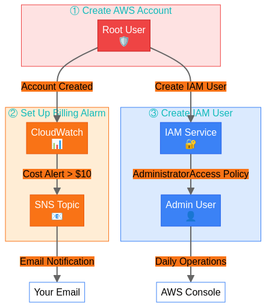
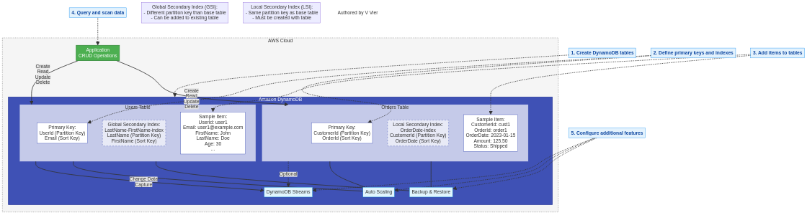

# AWS Labs Collection

  
   
  <em>Professional AWS labs with detailed architecture diagrams</em>
    

*Authored by V Vier*

A comprehensive collection of 50 professional AWS labs, progressing from beginner to advanced, covering every major AWS service and concept.

## 🚀 Overview

This repository contains hands-on labs for learning AWS services and concepts, organized by difficulty level:

- **Beginner Labs (1-15)**: Fundamental AWS services and concepts
- **Intermediate Labs (16-30)**: More complex scenarios and service integrations
- **Advanced Labs (31-42)**: Advanced architectures and solutions
- **Expert Labs (43-50)**: Enterprise-level architectures and specialized topics

Each lab includes:
- ✅ Step-by-step instructions with clear goals
- ✅ AWS console and CLI examples
- ✅ Architecture diagrams with labeled components
- ✅ Best practices and security considerations

  
   
  <em>DynamoDB architecture with clear data flows and component relationships</em>
    

## 📋 Lab Structure

### Beginner Labs
1. [Getting Started with AWS Console](beginner/lab-01-getting-started)
2. [IAM Basics - Users, Groups, Policies, and Roles](beginner/lab-02-iam-basics)
3. [S3 Fundamentals - Buckets, Objects, and Lifecycle Policies](beginner/lab-03-s3-fundamentals)
4. [EC2 Launch & Connect - Virtual Servers in AWS](beginner/lab-04-ec2-launch-connect)
5. [Security Groups & Network ACLs - AWS Network Security](beginner/lab-05-security-groups-network-acls)
6. [VPC Basics - Virtual Private Cloud Networking](beginner/lab-06-vpc-basics)
7. [RDS Database Setup - Managed Relational Databases](beginner/lab-07-rds-database-setup)
8. [CloudWatch Monitoring - Metrics, Alarms, and Dashboards](beginner/lab-08-cloudwatch-monitoring)
9. [Lambda Hello World - Serverless Functions](beginner/lab-09-lambda-hello-world)
10. [S3 Static Website Hosting - Simple Web Hosting](beginner/lab-10-s3-static-website-hosting)
11. [Route 53 DNS Setup - Domain Management](beginner/lab-11-route-53-dns-setup)
12. [CloudFormation Basics - Infrastructure as Code](beginner/lab-12-cloudformation-basics)
13. [EBS Volumes - Elastic Block Storage](beginner/lab-13-ebs-volumes)
14. [AWS CLI Setup - Command Line Interface](beginner/lab-14-aws-cli-setup)
15. [Cost Explorer & Budgets - Cost Management](beginner/lab-15-cost-explorer-budgets)

### Intermediate Labs
16. [VPC Peering - Connecting Virtual Private Clouds](intermediate/lab-16-vpc-peering)
17. [Auto Scaling Groups - Dynamic Resource Management](intermediate/lab-17-auto-scaling-groups)
18. [Load Balancers - Distributing Traffic to EC2 Instances](intermediate/lab-18-load-balancers)
19. [CloudFront CDN - Global Content Delivery](intermediate/lab-19-cloudfront-cdn)
20. [DynamoDB Basics - NoSQL Database Operations](intermediate/lab-20-dynamodb-basics)
21. [Elastic Beanstalk Deployment - Simplified Application Hosting](intermediate/lab-21-elastic-beanstalk-deployment)
22. Lambda & API Gateway - Serverless APIs *(Coming Soon)*
23. SNS & SQS - Messaging Services *(Coming Soon)*
24. ECS Containers - Docker on AWS *(Coming Soon)*
25. CloudWatch Logs & Insights - Log Analysis *(Coming Soon)*
26. Secrets Manager - Secure Secrets Storage *(Coming Soon)*
27. AWS Certificate Manager - SSL/TLS Certificates *(Coming Soon)*
28. ElastiCache - In-Memory Caching *(Coming Soon)*
29. Step Functions - Serverless Workflows *(Coming Soon)*
30. AWS Backup - Centralized Backup Service *(Coming Soon)*

### Advanced Labs
31. EKS Kubernetes - Container Orchestration *(Coming Soon)*
32. Aurora Database - High-Performance MySQL/PostgreSQL *(Coming Soon)*
33. Multi-Region Deployments - Global Applications *(Coming Soon)*
34. Transit Gateway - Network Transit Hub *(Coming Soon)*
35. AWS Organizations - Multi-Account Management *(Coming Soon)*
36. Direct Connect - Dedicated Network Connection *(Coming Soon)*
37. Cognito - User Authentication and Authorization *(Coming Soon)*
38. Kinesis - Real-Time Data Streaming *(Coming Soon)*
39. Redshift - Data Warehousing *(Coming Soon)*
40. EventBridge - Event-Driven Architecture *(Coming Soon)*
41. AWS WAF & Shield - Web Application Firewall *(Coming Soon)*
42. Disaster Recovery - Backup and Recovery Strategies *(Coming Soon)*

### Expert Labs
43. SageMaker - Machine Learning Platform *(Coming Soon)*
44. AWS Glue - ETL Service *(Coming Soon)*
45. Amazon MSK - Managed Kafka Service *(Coming Soon)*
46. AWS IoT Core - Internet of Things *(Coming Soon)*
47. AppSync - GraphQL APIs *(Coming Soon)*
48. AWS Control Tower - Landing Zone Setup *(Coming Soon)*
49. Service Catalog - Self-Service Provisioning *(Coming Soon)*
50. AWS Well-Architected Review - Best Practices Implementation *(Coming Soon)*

## 🏁 Getting Started

1. Choose a lab based on your experience level and interests
2. Follow the step-by-step instructions in the lab's README.md file
3. Use the provided architecture diagrams for visual guidance
4. Experiment with both AWS Console and CLI approaches

## 📋 Prerequisites

- AWS account with administrator access
- Basic understanding of cloud computing concepts
- Familiarity with command line interfaces (for CLI examples)
- For advanced labs: experience with the relevant technologies (e.g., Docker, Kubernetes)

## ⚠️ Important Notes

- Some labs may incur AWS charges. Always review the AWS Free Tier limitations.
- Remember to clean up resources after completing labs to avoid unexpected charges.
- The labs are designed to be completed in sequence within each difficulty level, but you can choose specific labs based on your interests.

## 🔗 Related Repositories

- [AWS Toolkit](https://github.com/x0VIER/aws-toolkit) - A collection of Python and Bash automation scripts for AWS

## 📚 Additional Resources

- [AWS Documentation](https://docs.aws.amazon.com/)
- [AWS Architecture Center](https://aws.amazon.com/architecture/)
- [AWS Well-Architected Framework](https://aws.amazon.com/architecture/well-architected/)
- [AWS Training and Certification](https://aws.amazon.com/training/)

## 🤝 Contributing

Contributions are welcome! Please feel free to submit a Pull Request.

1. Fork the repository
2. Create your feature branch (`git checkout -b feature/amazing-feature`)
3. Commit your changes (`git commit -m 'Add some amazing feature'`)
4. Push to the branch (`git push origin feature/amazing-feature`)
5. Open a Pull Request

## 📄 License

This project is licensed under the MIT License - see the LICENSE file for details.

## 👤 Author

**V Vier**

- GitHub: [@x0VIER](https://github.com/x0VIER)

---

  
⭐ Star this repository if you find it useful! ⭐

  
Created with ❤️ by V Vier

