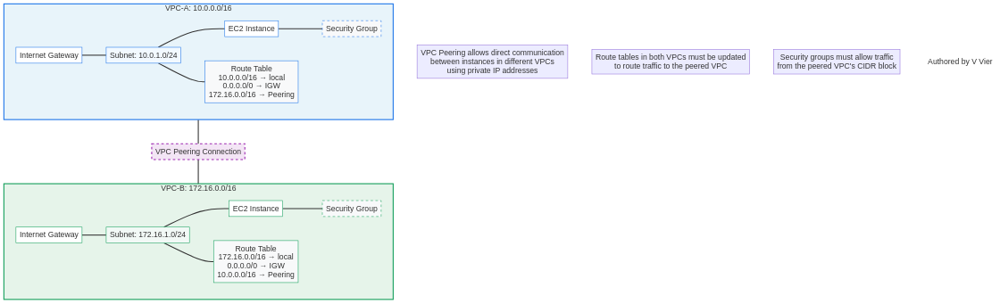

# Lab 16: VPC Peering - Connecting Virtual Private Clouds

*Authored by V Vier*

## Overview

VPC Peering is a networking connection between two Virtual Private Clouds (VPCs) that enables you to route traffic between them using private IPv4 addresses or IPv6 addresses. Instances in either VPC can communicate with each other as if they are within the same network. This lab guides you through setting up VPC peering between two VPCs in the same AWS account, configuring route tables, and testing connectivity.

## Architecture Diagram



## Prerequisites

- AWS account with administrator access
- Basic understanding of VPC concepts (subnets, route tables, security groups)
- Basic knowledge of EC2 instances

## Lab Objectives

1. Create two VPCs with non-overlapping CIDR blocks
2. Launch EC2 instances in each VPC
3. Create a VPC peering connection between the VPCs
4. Update route tables to enable traffic flow
5. Configure security groups to allow traffic
6. Test connectivity between instances in different VPCs

## Step 1: Create Two VPCs

### AWS Console

1. Navigate to the VPC Dashboard in the AWS Management Console
2. Create the first VPC:
   - Click "Create VPC"
   - Name: `VPC-A`
   - IPv4 CIDR block: `10.0.0.0/16`
   - Click "Create VPC"

3. Create the second VPC:
   - Click "Create VPC"
   - Name: `VPC-B`
   - IPv4 CIDR block: `172.16.0.0/16`
   - Click "Create VPC"

### AWS CLI

```bash
# Create VPC-A
aws ec2 create-vpc \
  --cidr-block 10.0.0.0/16 \
  --tag-specifications 'ResourceType=vpc,Tags=[{Key=Name,Value=VPC-A}]'

# Create VPC-B
aws ec2 create-vpc \
  --cidr-block 172.16.0.0/16 \
  --tag-specifications 'ResourceType=vpc,Tags=[{Key=Name,Value=VPC-B}]'
```

## Step 2: Create Subnets in Each VPC

### AWS Console

1. Create a subnet in VPC-A:
   - Navigate to "Subnets" in the VPC Dashboard
   - Click "Create subnet"
   - VPC ID: Select `VPC-A`
   - Subnet name: `VPC-A-Subnet`
   - Availability Zone: Select any AZ
   - IPv4 CIDR block: `10.0.1.0/24`
   - Click "Create subnet"

2. Create a subnet in VPC-B:
   - Click "Create subnet"
   - VPC ID: Select `VPC-B`
   - Subnet name: `VPC-B-Subnet`
   - Availability Zone: Select any AZ
   - IPv4 CIDR block: `172.16.1.0/24`
   - Click "Create subnet"

### AWS CLI

```bash
# Get VPC IDs
VPC_A_ID=$(aws ec2 describe-vpcs --filters "Name=tag:Name,Values=VPC-A" --query "Vpcs[0].VpcId" --output text)
VPC_B_ID=$(aws ec2 describe-vpcs --filters "Name=tag:Name,Values=VPC-B" --query "Vpcs[0].VpcId" --output text)

# Create subnet in VPC-A
aws ec2 create-subnet \
  --vpc-id $VPC_A_ID \
  --cidr-block 10.0.1.0/24 \
  --availability-zone us-east-1a \
  --tag-specifications 'ResourceType=subnet,Tags=[{Key=Name,Value=VPC-A-Subnet}]'

# Create subnet in VPC-B
aws ec2 create-subnet \
  --vpc-id $VPC_B_ID \
  --cidr-block 172.16.1.0/24 \
  --availability-zone us-east-1a \
  --tag-specifications 'ResourceType=subnet,Tags=[{Key=Name,Value=VPC-B-Subnet}]'
```

## Step 3: Create Internet Gateways and Attach to VPCs

### AWS Console

1. Create and attach Internet Gateway to VPC-A:
   - Navigate to "Internet Gateways" in the VPC Dashboard
   - Click "Create internet gateway"
   - Name: `VPC-A-IGW`
   - Click "Create internet gateway"
   - Select the newly created IGW
   - Click "Actions" > "Attach to VPC"
   - Select `VPC-A`
   - Click "Attach internet gateway"

2. Create and attach Internet Gateway to VPC-B:
   - Click "Create internet gateway"
   - Name: `VPC-B-IGW`
   - Click "Create internet gateway"
   - Select the newly created IGW
   - Click "Actions" > "Attach to VPC"
   - Select `VPC-B`
   - Click "Attach internet gateway"

### AWS CLI

```bash
# Create Internet Gateway for VPC-A
aws ec2 create-internet-gateway \
  --tag-specifications 'ResourceType=internet-gateway,Tags=[{Key=Name,Value=VPC-A-IGW}]'

# Get the Internet Gateway ID
IGW_A_ID=$(aws ec2 describe-internet-gateways --filters "Name=tag:Name,Values=VPC-A-IGW" --query "InternetGateways[0].InternetGatewayId" --output text)

# Attach Internet Gateway to VPC-A
aws ec2 attach-internet-gateway \
  --internet-gateway-id $IGW_A_ID \
  --vpc-id $VPC_A_ID

# Create Internet Gateway for VPC-B
aws ec2 create-internet-gateway \
  --tag-specifications 'ResourceType=internet-gateway,Tags=[{Key=Name,Value=VPC-B-IGW}]'

# Get the Internet Gateway ID
IGW_B_ID=$(aws ec2 describe-internet-gateways --filters "Name=tag:Name,Values=VPC-B-IGW" --query "InternetGateways[0].InternetGatewayId" --output text)

# Attach Internet Gateway to VPC-B
aws ec2 attach-internet-gateway \
  --internet-gateway-id $IGW_B_ID \
  --vpc-id $VPC_B_ID
```

## Step 4: Update Route Tables

### AWS Console

1. Update the route table for VPC-A:
   - Navigate to "Route Tables" in the VPC Dashboard
   - Find the route table associated with `VPC-A`
   - Click "Actions" > "Edit routes"
   - Click "Add route"
   - Destination: `0.0.0.0/0`
   - Target: Select "Internet Gateway" and choose `VPC-A-IGW`
   - Click "Save routes"

2. Update the route table for VPC-B:
   - Find the route table associated with `VPC-B`
   - Click "Actions" > "Edit routes"
   - Click "Add route"
   - Destination: `0.0.0.0/0`
   - Target: Select "Internet Gateway" and choose `VPC-B-IGW`
   - Click "Save routes"

### AWS CLI

```bash
# Get route table IDs
RTB_A_ID=$(aws ec2 describe-route-tables --filters "Name=vpc-id,Values=$VPC_A_ID" --query "RouteTables[0].RouteTableId" --output text)
RTB_B_ID=$(aws ec2 describe-route-tables --filters "Name=vpc-id,Values=$VPC_B_ID" --query "RouteTables[0].RouteTableId" --output text)

# Add route to Internet Gateway for VPC-A
aws ec2 create-route \
  --route-table-id $RTB_A_ID \
  --destination-cidr-block 0.0.0.0/0 \
  --gateway-id $IGW_A_ID

# Add route to Internet Gateway for VPC-B
aws ec2 create-route \
  --route-table-id $RTB_B_ID \
  --destination-cidr-block 0.0.0.0/0 \
  --gateway-id $IGW_B_ID
```

## Step 5: Launch EC2 Instances in Each VPC

### AWS Console

1. Launch an EC2 instance in VPC-A:
   - Navigate to the EC2 Dashboard
   - Click "Launch instance"
   - Name: `VPC-A-Instance`
   - Choose Amazon Linux 2 AMI
   - Instance type: t2.micro
   - Key pair: Create or select an existing key pair
   - Network settings:
     - VPC: Select `VPC-A`
     - Subnet: Select `VPC-A-Subnet`
     - Auto-assign public IP: Enable
   - Security group: Create a new security group
     - Name: `VPC-A-SG`
     - Add rule: SSH (port 22) from your IP
     - Add rule: ICMP (ping) from anywhere
   - Click "Launch instance"

2. Launch an EC2 instance in VPC-B:
   - Click "Launch instance"
   - Name: `VPC-B-Instance`
   - Choose Amazon Linux 2 AMI
   - Instance type: t2.micro
   - Key pair: Use the same key pair as before
   - Network settings:
     - VPC: Select `VPC-B`
     - Subnet: Select `VPC-B-Subnet`
     - Auto-assign public IP: Enable
   - Security group: Create a new security group
     - Name: `VPC-B-SG`
     - Add rule: SSH (port 22) from your IP
     - Add rule: ICMP (ping) from anywhere
   - Click "Launch instance"

### AWS CLI

```bash
# Get subnet IDs
SUBNET_A_ID=$(aws ec2 describe-subnets --filters "Name=vpc-id,Values=$VPC_A_ID" --query "Subnets[0].SubnetId" --output text)
SUBNET_B_ID=$(aws ec2 describe-subnets --filters "Name=vpc-id,Values=$VPC_B_ID" --query "Subnets[0].SubnetId" --output text)

# Create security group for VPC-A
aws ec2 create-security-group \
  --group-name VPC-A-SG \
  --description "Security group for VPC-A instance" \
  --vpc-id $VPC_A_ID \
  --tag-specifications 'ResourceType=security-group,Tags=[{Key=Name,Value=VPC-A-SG}]'

SG_A_ID=$(aws ec2 describe-security-groups --filters "Name=group-name,Values=VPC-A-SG" --query "SecurityGroups[0].GroupId" --output text)

# Add rules to security group for VPC-A
aws ec2 authorize-security-group-ingress \
  --group-id $SG_A_ID \
  --protocol tcp \
  --port 22 \
  --cidr $(curl -s https://checkip.amazonaws.com)/32

aws ec2 authorize-security-group-ingress \
  --group-id $SG_A_ID \
  --protocol icmp \
  --port -1 \
  --cidr 0.0.0.0/0

# Create security group for VPC-B
aws ec2 create-security-group \
  --group-name VPC-B-SG \
  --description "Security group for VPC-B instance" \
  --vpc-id $VPC_B_ID \
  --tag-specifications 'ResourceType=security-group,Tags=[{Key=Name,Value=VPC-B-SG}]'

SG_B_ID=$(aws ec2 describe-security-groups --filters "Name=group-name,Values=VPC-B-SG" --query "SecurityGroups[0].GroupId" --output text)

# Add rules to security group for VPC-B
aws ec2 authorize-security-group-ingress \
  --group-id $SG_B_ID \
  --protocol tcp \
  --port 22 \
  --cidr $(curl -s https://checkip.amazonaws.com)/32

aws ec2 authorize-security-group-ingress \
  --group-id $SG_B_ID \
  --protocol icmp \
  --port -1 \
  --cidr 0.0.0.0/0

# Launch instance in VPC-A
aws ec2 run-instances \
  --image-id ami-0c55b159cbfafe1f0 \
  --instance-type t2.micro \
  --key-name your-key-pair \
  --subnet-id $SUBNET_A_ID \
  --security-group-ids $SG_A_ID \
  --associate-public-ip-address \
  --tag-specifications 'ResourceType=instance,Tags=[{Key=Name,Value=VPC-A-Instance}]'

# Launch instance in VPC-B
aws ec2 run-instances \
  --image-id ami-0c55b159cbfafe1f0 \
  --instance-type t2.micro \
  --key-name your-key-pair \
  --subnet-id $SUBNET_B_ID \
  --security-group-ids $SG_B_ID \
  --associate-public-ip-address \
  --tag-specifications 'ResourceType=instance,Tags=[{Key=Name,Value=VPC-B-Instance}]'
```

## Step 6: Create VPC Peering Connection

### AWS Console

1. Navigate to "Peering Connections" in the VPC Dashboard
2. Click "Create peering connection"
3. Configure the peering connection:
   - Name: `VPC-A-to-VPC-B`
   - VPC (Requester): Select `VPC-A`
   - Account: "My account"
   - Region: "This region"
   - VPC (Accepter): Select `VPC-B`
   - Click "Create peering connection"
4. Accept the peering connection:
   - Select the newly created peering connection
   - Click "Actions" > "Accept request"
   - Click "Accept request" in the confirmation dialog

### AWS CLI

```bash
# Create VPC peering connection
aws ec2 create-vpc-peering-connection \
  --vpc-id $VPC_A_ID \
  --peer-vpc-id $VPC_B_ID \
  --tag-specifications 'ResourceType=vpc-peering-connection,Tags=[{Key=Name,Value=VPC-A-to-VPC-B}]'

# Get the peering connection ID
PEERING_ID=$(aws ec2 describe-vpc-peering-connections \
  --filters "Name=tag:Name,Values=VPC-A-to-VPC-B" \
  --query "VpcPeeringConnections[0].VpcPeeringConnectionId" \
  --output text)

# Accept the peering connection
aws ec2 accept-vpc-peering-connection \
  --vpc-peering-connection-id $PEERING_ID
```

## Step 7: Update Route Tables for VPC Peering

### AWS Console

1. Update the route table for VPC-A:
   - Navigate to "Route Tables" in the VPC Dashboard
   - Find the route table associated with `VPC-A`
   - Click "Actions" > "Edit routes"
   - Click "Add route"
   - Destination: `172.16.0.0/16` (CIDR block of VPC-B)
   - Target: Select "Peering Connection" and choose the peering connection
   - Click "Save routes"

2. Update the route table for VPC-B:
   - Find the route table associated with `VPC-B`
   - Click "Actions" > "Edit routes"
   - Click "Add route"
   - Destination: `10.0.0.0/16` (CIDR block of VPC-A)
   - Target: Select "Peering Connection" and choose the peering connection
   - Click "Save routes"

### AWS CLI

```bash
# Add route to VPC-A route table
aws ec2 create-route \
  --route-table-id $RTB_A_ID \
  --destination-cidr-block 172.16.0.0/16 \
  --vpc-peering-connection-id $PEERING_ID

# Add route to VPC-B route table
aws ec2 create-route \
  --route-table-id $RTB_B_ID \
  --destination-cidr-block 10.0.0.0/16 \
  --vpc-peering-connection-id $PEERING_ID
```

## Step 8: Update Security Groups to Allow Traffic Between VPCs

### AWS Console

1. Update the security group for VPC-A:
   - Navigate to "Security Groups" in the VPC Dashboard
   - Select the security group for the instance in VPC-A
   - Click "Edit inbound rules"
   - Click "Add rule"
   - Type: All ICMP - IPv4
   - Source: `172.16.0.0/16` (CIDR block of VPC-B)
   - Click "Save rules"

2. Update the security group for VPC-B:
   - Select the security group for the instance in VPC-B
   - Click "Edit inbound rules"
   - Click "Add rule"
   - Type: All ICMP - IPv4
   - Source: `10.0.0.0/16` (CIDR block of VPC-A)
   - Click "Save rules"

### AWS CLI

```bash
# Update security group for VPC-A
aws ec2 authorize-security-group-ingress \
  --group-id $SG_A_ID \
  --protocol icmp \
  --port -1 \
  --cidr 172.16.0.0/16

# Update security group for VPC-B
aws ec2 authorize-security-group-ingress \
  --group-id $SG_B_ID \
  --protocol icmp \
  --port -1 \
  --cidr 10.0.0.0/16
```

## Step 9: Test Connectivity Between VPCs

1. Connect to the instance in VPC-A using SSH:
   ```bash
   ssh -i your-key-pair.pem ec2-user@<VPC-A-Instance-Public-IP>
   ```

2. Get the private IP address of the instance in VPC-B from the EC2 Dashboard

3. Ping the instance in VPC-B from the instance in VPC-A:
   ```bash
   ping <VPC-B-Instance-Private-IP>
   ```

4. You should see successful ping responses, confirming that the VPC peering connection is working correctly

## Cleanup

To avoid incurring charges, delete the resources created in this lab:

### AWS Console

1. Terminate the EC2 instances
2. Delete the VPC peering connection
3. Delete the security groups
4. Detach and delete the Internet Gateways
5. Delete the subnets
6. Delete the VPCs

### AWS CLI

```bash
# Get instance IDs
INSTANCE_A_ID=$(aws ec2 describe-instances --filters "Name=tag:Name,Values=VPC-A-Instance" --query "Reservations[0].Instances[0].InstanceId" --output text)
INSTANCE_B_ID=$(aws ec2 describe-instances --filters "Name=tag:Name,Values=VPC-B-Instance" --query "Reservations[0].Instances[0].InstanceId" --output text)

# Terminate instances
aws ec2 terminate-instances --instance-ids $INSTANCE_A_ID $INSTANCE_B_ID

# Wait for instances to terminate
aws ec2 wait instance-terminated --instance-ids $INSTANCE_A_ID $INSTANCE_B_ID

# Delete VPC peering connection
aws ec2 delete-vpc-peering-connection --vpc-peering-connection-id $PEERING_ID

# Delete security groups
aws ec2 delete-security-group --group-id $SG_A_ID
aws ec2 delete-security-group --group-id $SG_B_ID

# Detach and delete Internet Gateways
aws ec2 detach-internet-gateway --internet-gateway-id $IGW_A_ID --vpc-id $VPC_A_ID
aws ec2 detach-internet-gateway --internet-gateway-id $IGW_B_ID --vpc-id $VPC_B_ID
aws ec2 delete-internet-gateway --internet-gateway-id $IGW_A_ID
aws ec2 delete-internet-gateway --internet-gateway-id $IGW_B_ID

# Delete subnets
SUBNET_A_ID=$(aws ec2 describe-subnets --filters "Name=vpc-id,Values=$VPC_A_ID" --query "Subnets[0].SubnetId" --output text)
SUBNET_B_ID=$(aws ec2 describe-subnets --filters "Name=vpc-id,Values=$VPC_B_ID" --query "Subnets[0].SubnetId" --output text)
aws ec2 delete-subnet --subnet-id $SUBNET_A_ID
aws ec2 delete-subnet --subnet-id $SUBNET_B_ID

# Delete VPCs
aws ec2 delete-vpc --vpc-id $VPC_A_ID
aws ec2 delete-vpc --vpc-id $VPC_B_ID
```

## Conclusion

In this lab, you learned how to:
- Create VPCs with non-overlapping CIDR blocks
- Set up VPC peering between two VPCs
- Configure route tables to enable traffic flow between VPCs
- Update security groups to allow traffic between instances in different VPCs
- Test connectivity between instances in peered VPCs

VPC peering is a fundamental networking feature in AWS that allows you to connect VPCs together. This is useful for scenarios where you need to share resources between VPCs, such as connecting a production VPC to a development VPC, or connecting VPCs owned by different business units within an organization.

## Next Steps

- Learn about Transit Gateway, which allows you to connect multiple VPCs and on-premises networks
- Explore VPC peering across different AWS regions
- Implement more complex networking scenarios with multiple VPCs and subnets
