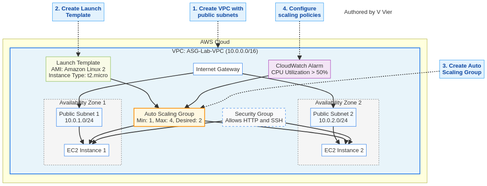

# Lab 17: Auto Scaling Groups - Dynamic Resource Management

*Authored by V Vier*

## Overview

Auto Scaling Groups (ASGs) in AWS allow you to automatically adjust the number of EC2 instances in a group based on demand. This helps ensure that you have the right number of instances available to handle the load for your application while optimizing costs. This lab guides you through setting up an Auto Scaling Group with a launch template, configuring scaling policies, and testing the automatic scaling behavior.

## Architecture Diagram



## Prerequisites

- AWS account with administrator access
- Basic understanding of EC2 instances and VPC concepts
- Basic knowledge of CloudWatch metrics and alarms

## Lab Objectives

1. Create a VPC with public subnets across multiple Availability Zones
2. Create a launch template for EC2 instances
3. Create an Auto Scaling Group using the launch template
4. Configure scaling policies based on CPU utilization
5. Test the scaling policies by generating load
6. Monitor the Auto Scaling Group behavior

## Step 1: Create a VPC with Public Subnets

### AWS Console

1. Navigate to the VPC Dashboard in the AWS Management Console
2. Click "Create VPC"
3. Select "VPC and more"
4. Configure the VPC:
   - Name tag: `ASG-Lab-VPC`
   - IPv4 CIDR block: `10.0.0.0/16`
   - Number of Availability Zones: `2`
   - Number of public subnets: `2`
   - Number of private subnets: `0`
   - NAT gateways: `None`
   - VPC endpoints: `None`
   - Click "Create VPC"

### AWS CLI

```bash
# Create VPC
aws ec2 create-vpc \
  --cidr-block 10.0.0.0/16 \
  --tag-specifications 'ResourceType=vpc,Tags=[{Key=Name,Value=ASG-Lab-VPC}]'

# Get VPC ID
VPC_ID=$(aws ec2 describe-vpcs --filters "Name=tag:Name,Values=ASG-Lab-VPC" --query "Vpcs[0].VpcId" --output text)

# Create Internet Gateway
aws ec2 create-internet-gateway \
  --tag-specifications 'ResourceType=internet-gateway,Tags=[{Key=Name,Value=ASG-Lab-IGW}]'

# Get Internet Gateway ID
IGW_ID=$(aws ec2 describe-internet-gateways --filters "Name=tag:Name,Values=ASG-Lab-IGW" --query "InternetGateways[0].InternetGatewayId" --output text)

# Attach Internet Gateway to VPC
aws ec2 attach-internet-gateway \
  --internet-gateway-id $IGW_ID \
  --vpc-id $VPC_ID

# Create public subnets in different AZs
aws ec2 create-subnet \
  --vpc-id $VPC_ID \
  --cidr-block 10.0.1.0/24 \
  --availability-zone us-east-1a \
  --tag-specifications 'ResourceType=subnet,Tags=[{Key=Name,Value=ASG-Lab-Public-Subnet-1}]'

aws ec2 create-subnet \
  --vpc-id $VPC_ID \
  --cidr-block 10.0.2.0/24 \
  --availability-zone us-east-1b \
  --tag-specifications 'ResourceType=subnet,Tags=[{Key=Name,Value=ASG-Lab-Public-Subnet-2}]'

# Get subnet IDs
SUBNET_1_ID=$(aws ec2 describe-subnets --filters "Name=tag:Name,Values=ASG-Lab-Public-Subnet-1" --query "Subnets[0].SubnetId" --output text)
SUBNET_2_ID=$(aws ec2 describe-subnets --filters "Name=tag:Name,Values=ASG-Lab-Public-Subnet-2" --query "Subnets[0].SubnetId" --output text)

# Create route table
aws ec2 create-route-table \
  --vpc-id $VPC_ID \
  --tag-specifications 'ResourceType=route-table,Tags=[{Key=Name,Value=ASG-Lab-Public-RT}]'

# Get route table ID
RT_ID=$(aws ec2 describe-route-tables --filters "Name=tag:Name,Values=ASG-Lab-Public-RT" --query "RouteTables[0].RouteTableId" --output text)

# Create route to Internet Gateway
aws ec2 create-route \
  --route-table-id $RT_ID \
  --destination-cidr-block 0.0.0.0/0 \
  --gateway-id $IGW_ID

# Associate route table with subnets
aws ec2 associate-route-table \
  --route-table-id $RT_ID \
  --subnet-id $SUBNET_1_ID

aws ec2 associate-route-table \
  --route-table-id $RT_ID \
  --subnet-id $SUBNET_2_ID
```

## Step 2: Create a Security Group for EC2 Instances

### AWS Console

1. Navigate to the VPC Dashboard in the AWS Management Console
2. Click "Security Groups" in the left navigation pane
3. Click "Create security group"
4. Configure the security group:
   - Security group name: `ASG-Lab-SG`
   - Description: `Security group for Auto Scaling Group instances`
   - VPC: Select `ASG-Lab-VPC`
   - Inbound rules:
     - Add rule: HTTP (port 80) from anywhere (0.0.0.0/0)
     - Add rule: SSH (port 22) from your IP
   - Outbound rules: Allow all traffic
   - Click "Create security group"

### AWS CLI

```bash
# Create security group
aws ec2 create-security-group \
  --group-name ASG-Lab-SG \
  --description "Security group for Auto Scaling Group instances" \
  --vpc-id $VPC_ID \
  --tag-specifications 'ResourceType=security-group,Tags=[{Key=Name,Value=ASG-Lab-SG}]'

# Get security group ID
SG_ID=$(aws ec2 describe-security-groups --filters "Name=group-name,Values=ASG-Lab-SG" --query "SecurityGroups[0].GroupId" --output text)

# Add inbound rules
aws ec2 authorize-security-group-ingress \
  --group-id $SG_ID \
  --protocol tcp \
  --port 80 \
  --cidr 0.0.0.0/0

aws ec2 authorize-security-group-ingress \
  --group-id $SG_ID \
  --protocol tcp \
  --port 22 \
  --cidr $(curl -s https://checkip.amazonaws.com)/32
```

## Step 3: Create a Launch Template

### AWS Console

1. Navigate to the EC2 Dashboard in the AWS Management Console
2. Click "Launch Templates" in the left navigation pane
3. Click "Create launch template"
4. Configure the launch template:
   - Launch template name: `ASG-Lab-Template`
   - Template version description: `Initial version`
   - Auto Scaling guidance: Check the box
   - AMI: Amazon Linux 2 AMI
   - Instance type: t2.micro
   - Key pair: Create or select an existing key pair
   - Network settings:
     - Subnet: Don't include in launch template
     - Security groups: Select `ASG-Lab-SG`
   - Advanced details:
     - User data:
       ```bash
       #!/bin/bash
       yum update -y
       yum install -y httpd stress
       systemctl start httpd
       systemctl enable httpd
       echo "<h1>Hello from $(hostname -f)</h1>" > /var/www/html/index.html
       ```
   - Click "Create launch template"

### AWS CLI

```bash
# Create launch template
cat > user-data.txt << 'EOF'
#!/bin/bash
yum update -y
yum install -y httpd stress
systemctl start httpd
systemctl enable httpd
echo "<h1>Hello from $(hostname -f)</h1>" > /var/www/html/index.html
EOF

# Encode user data in base64
USER_DATA=$(base64 -w 0 user-data.txt)

# Create launch template
aws ec2 create-launch-template \
  --launch-template-name ASG-Lab-Template \
  --version-description "Initial version" \
  --launch-template-data "{
    \"ImageId\": \"ami-0c55b159cbfafe1f0\",
    \"InstanceType\": \"t2.micro\",
    \"KeyName\": \"your-key-pair\",
    \"SecurityGroupIds\": [\"$SG_ID\"],
    \"UserData\": \"$USER_DATA\"
  }" \
  --tag-specifications 'ResourceType=launch-template,Tags=[{Key=Name,Value=ASG-Lab-Template}]'
```

## Step 4: Create an Auto Scaling Group

### AWS Console

1. Navigate to the EC2 Dashboard in the AWS Management Console
2. Click "Auto Scaling Groups" in the left navigation pane
3. Click "Create Auto Scaling group"
4. Configure the Auto Scaling group:
   - Auto Scaling group name: `ASG-Lab-Group`
   - Launch template: Select `ASG-Lab-Template`
   - Click "Next"
5. Configure network settings:
   - VPC: Select `ASG-Lab-VPC`
   - Availability Zones and subnets: Select both public subnets
   - Click "Next"
6. Configure advanced options:
   - Load balancing: No load balancer
   - Health checks:
     - Health check type: EC2
     - Health check grace period: 300 seconds
   - Click "Next"
7. Configure group size and scaling policies:
   - Desired capacity: 2
   - Minimum capacity: 1
   - Maximum capacity: 4
   - Scaling policies: Select "Target tracking scaling policy"
     - Scaling policy name: `CPU-Target-Tracking-Policy`
     - Metric type: Average CPU utilization
     - Target value: 50
     - Instance warmup: 300 seconds
   - Click "Next"
8. Add notifications (optional):
   - Click "Next"
9. Add tags:
   - Key: Name
   - Value: ASG-Lab-Instance
   - Click "Next"
10. Review and click "Create Auto Scaling group"

### AWS CLI

```bash
# Create Auto Scaling Group
aws autoscaling create-auto-scaling-group \
  --auto-scaling-group-name ASG-Lab-Group \
  --launch-template "LaunchTemplateName=ASG-Lab-Template,Version=\$Latest" \
  --min-size 1 \
  --max-size 4 \
  --desired-capacity 2 \
  --vpc-zone-identifier "$SUBNET_1_ID,$SUBNET_2_ID" \
  --health-check-type EC2 \
  --health-check-grace-period 300 \
  --tags "Key=Name,Value=ASG-Lab-Instance,PropagateAtLaunch=true"

# Create target tracking scaling policy
aws autoscaling put-scaling-policy \
  --auto-scaling-group-name ASG-Lab-Group \
  --policy-name CPU-Target-Tracking-Policy \
  --policy-type TargetTrackingScaling \
  --target-tracking-configuration "{
    \"PredefinedMetricSpecification\": {
      \"PredefinedMetricType\": \"ASGAverageCPUUtilization\"
    },
    \"TargetValue\": 50.0,
    \"DisableScaleIn\": false
  }"
```

## Step 5: Verify Auto Scaling Group Creation

1. Navigate to the EC2 Dashboard in the AWS Management Console
2. Click "Auto Scaling Groups" in the left navigation pane
3. Select `ASG-Lab-Group`
4. Check the "Activity" tab to see the instances being launched
5. Check the "Instances" tab to see the running instances
6. Wait for the instances to pass health checks and reach the "InService" state

## Step 6: Test the Auto Scaling Group

### Test Scale-Out (Adding Instances)

1. Connect to one of the instances using SSH:
   ```bash
   ssh -i your-key-pair.pem ec2-user@<instance-public-ip>
   ```

2. Generate CPU load using the stress tool:
   ```bash
   sudo stress --cpu 1 --timeout 600
   ```

3. Open another terminal and connect to the second instance:
   ```bash
   ssh -i your-key-pair.pem ec2-user@<instance-public-ip>
   ```

4. Generate CPU load on the second instance as well:
   ```bash
   sudo stress --cpu 1 --timeout 600
   ```

5. Monitor the Auto Scaling Group in the AWS Console:
   - Navigate to the EC2 Dashboard
   - Click "Auto Scaling Groups"
   - Select `ASG-Lab-Group`
   - Check the "Activity" tab to see new instances being launched
   - Check the "Monitoring" tab to see the CPU utilization metrics

### Test Scale-In (Removing Instances)

1. Stop the stress tool on both instances by pressing Ctrl+C
2. Monitor the Auto Scaling Group in the AWS Console:
   - The CPU utilization will decrease
   - After some time, the Auto Scaling Group will terminate excess instances
   - Check the "Activity" tab to see instances being terminated

## Step 7: Create a Simple Step Scaling Policy (Optional)

### AWS Console

1. Navigate to the EC2 Dashboard in the AWS Management Console
2. Click "Auto Scaling Groups" in the left navigation pane
3. Select `ASG-Lab-Group`
4. Go to the "Automatic scaling" tab
5. Click "Create dynamic scaling policy"
6. Configure the step scaling policy:
   - Policy type: Step scaling
   - Name: `High-CPU-Step-Policy`
   - CloudWatch alarm:
     - Click "Create a CloudWatch alarm"
     - Select "EC2 > By Auto Scaling Group"
     - Select `ASG-Lab-Group`
     - Select "CPU Utilization"
     - Statistic: Average
     - Period: 1 minute
     - Threshold type: Static
     - Whenever CPU Utilization is: Greater than or equal to 70%
     - For at least: 1 consecutive period
     - Alarm name: `ASG-High-CPU-Alarm`
     - Click "Create alarm"
   - Take the action:
     - Add 1 capacity unit
     - And then wait: 300 seconds
   - Click "Create"

### AWS CLI

```bash
# Create CloudWatch alarm
aws cloudwatch put-metric-alarm \
  --alarm-name ASG-High-CPU-Alarm \
  --metric-name CPUUtilization \
  --namespace AWS/EC2 \
  --statistic Average \
  --period 60 \
  --threshold 70 \
  --comparison-operator GreaterThanOrEqualToThreshold \
  --dimensions "Name=AutoScalingGroupName,Value=ASG-Lab-Group" \
  --evaluation-periods 1 \
  --alarm-actions "arn:aws:autoscaling:$(aws configure get region):$(aws sts get-caller-identity --query Account --output text):scalingPolicy:*:autoScalingGroupName/ASG-Lab-Group:policyName/High-CPU-Step-Policy"

# Create step scaling policy
aws autoscaling put-scaling-policy \
  --auto-scaling-group-name ASG-Lab-Group \
  --policy-name High-CPU-Step-Policy \
  --policy-type StepScaling \
  --adjustment-type ChangeInCapacity \
  --step-adjustments "MetricIntervalLowerBound=0.0,ScalingAdjustment=1" \
  --cooldown 300
```

## Cleanup

To avoid incurring charges, delete the resources created in this lab:

### AWS Console

1. Navigate to the EC2 Dashboard in the AWS Management Console
2. Click "Auto Scaling Groups" in the left navigation pane
3. Select `ASG-Lab-Group`
4. Click "Delete"
5. Type "delete" to confirm and click "Delete"
6. Wait for the Auto Scaling Group to be deleted
7. Delete the launch template:
   - Click "Launch Templates" in the left navigation pane
   - Select `ASG-Lab-Template`
   - Click "Actions" > "Delete template"
   - Confirm the deletion
8. Delete the VPC and associated resources:
   - Navigate to the VPC Dashboard
   - Click "Your VPCs" in the left navigation pane
   - Select `ASG-Lab-VPC`
   - Click "Actions" > "Delete VPC"
   - Check "Delete all associated resources"
   - Click "Delete"

### AWS CLI

```bash
# Delete Auto Scaling Group
aws autoscaling delete-auto-scaling-group \
  --auto-scaling-group-name ASG-Lab-Group \
  --force-delete

# Wait for Auto Scaling Group to be deleted
echo "Waiting for Auto Scaling Group to be deleted..."
aws autoscaling wait auto-scaling-groups-deleted \
  --auto-scaling-group-names ASG-Lab-Group

# Delete launch template
aws ec2 delete-launch-template \
  --launch-template-name ASG-Lab-Template

# Delete security group
aws ec2 delete-security-group \
  --group-id $SG_ID

# Detach Internet Gateway from VPC
aws ec2 detach-internet-gateway \
  --internet-gateway-id $IGW_ID \
  --vpc-id $VPC_ID

# Delete Internet Gateway
aws ec2 delete-internet-gateway \
  --internet-gateway-id $IGW_ID

# Delete subnets
aws ec2 delete-subnet \
  --subnet-id $SUBNET_1_ID

aws ec2 delete-subnet \
  --subnet-id $SUBNET_2_ID

# Delete route table
aws ec2 delete-route-table \
  --route-table-id $RT_ID

# Delete VPC
aws ec2 delete-vpc \
  --vpc-id $VPC_ID
```

## Conclusion

In this lab, you learned how to:
- Create a VPC with public subnets across multiple Availability Zones
- Create a launch template for EC2 instances
- Create an Auto Scaling Group using the launch template
- Configure target tracking scaling policies based on CPU utilization
- Test the scaling policies by generating load
- Monitor the Auto Scaling Group behavior

Auto Scaling Groups are a powerful feature in AWS that help you maintain application availability and reduce costs by automatically adjusting the number of EC2 instances based on demand. By using Auto Scaling Groups, you can ensure that your application has the right amount of compute capacity to handle the current load.

## Next Steps

- Learn about Elastic Load Balancing and how to integrate it with Auto Scaling Groups
- Explore more advanced scaling policies, such as scheduled scaling
- Implement custom CloudWatch metrics for scaling
- Set up notifications for scaling events using Amazon SNS
- Learn about EC2 Fleet and Spot Fleet for cost optimization
