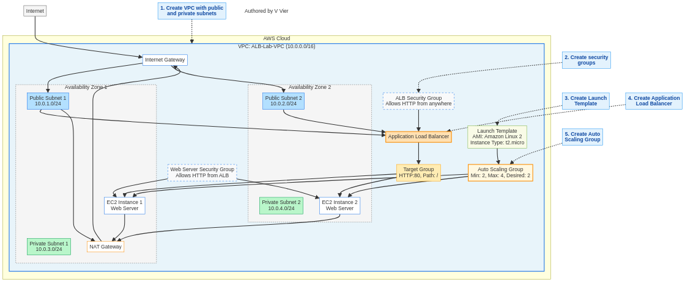

# Lab 18: Load Balancers - Distributing Traffic to EC2 Instances

*Authored by V Vier*

## Overview

Elastic Load Balancing (ELB) automatically distributes incoming application traffic across multiple targets, such as EC2 instances, containers, and IP addresses. This lab guides you through setting up an Application Load Balancer (ALB) to distribute HTTP traffic to EC2 instances in multiple Availability Zones, integrating it with an Auto Scaling Group, and configuring health checks and routing rules.

## Architecture Diagram



## Prerequisites

- AWS account with administrator access
- Basic understanding of EC2 instances and VPC concepts
- Basic knowledge of Auto Scaling Groups (see Lab 17)
- Basic understanding of HTTP/HTTPS protocols

## Lab Objectives

1. Create a VPC with public and private subnets across multiple Availability Zones
2. Set up a NAT Gateway for outbound internet access from private subnets
3. Create an Application Load Balancer in the public subnets
4. Launch EC2 instances in private subnets with a web server
5. Configure the ALB to route traffic to the EC2 instances
6. Create an Auto Scaling Group and integrate it with the ALB
7. Test the load balancer functionality and failover

## Step 1: Create a VPC with Public and Private Subnets

### AWS Console

1. Navigate to the VPC Dashboard in the AWS Management Console
2. Click "Create VPC"
3. Select "VPC and more"
4. Configure the VPC:
   - Name tag: `ALB-Lab-VPC`
   - IPv4 CIDR block: `10.0.0.0/16`
   - Number of Availability Zones: `2`
   - Number of public subnets: `2`
   - Number of private subnets: `2`
   - NAT gateways: `1 per AZ`
   - VPC endpoints: `None`
   - Click "Create VPC"

### AWS CLI

```bash
# Create VPC
aws ec2 create-vpc \
  --cidr-block 10.0.0.0/16 \
  --tag-specifications 'ResourceType=vpc,Tags=[{Key=Name,Value=ALB-Lab-VPC}]'

# Get VPC ID
VPC_ID=$(aws ec2 describe-vpcs --filters "Name=tag:Name,Values=ALB-Lab-VPC" --query "Vpcs[0].VpcId" --output text)

# Create Internet Gateway
aws ec2 create-internet-gateway \
  --tag-specifications 'ResourceType=internet-gateway,Tags=[{Key=Name,Value=ALB-Lab-IGW}]'

# Get Internet Gateway ID
IGW_ID=$(aws ec2 describe-internet-gateways --filters "Name=tag:Name,Values=ALB-Lab-IGW" --query "InternetGateways[0].InternetGatewayId" --output text)

# Attach Internet Gateway to VPC
aws ec2 attach-internet-gateway \
  --internet-gateway-id $IGW_ID \
  --vpc-id $VPC_ID

# Create public subnets in different AZs
aws ec2 create-subnet \
  --vpc-id $VPC_ID \
  --cidr-block 10.0.1.0/24 \
  --availability-zone us-east-1a \
  --tag-specifications 'ResourceType=subnet,Tags=[{Key=Name,Value=ALB-Lab-Public-Subnet-1}]'

aws ec2 create-subnet \
  --vpc-id $VPC_ID \
  --cidr-block 10.0.2.0/24 \
  --availability-zone us-east-1b \
  --tag-specifications 'ResourceType=subnet,Tags=[{Key=Name,Value=ALB-Lab-Public-Subnet-2}]'

# Create private subnets in different AZs
aws ec2 create-subnet \
  --vpc-id $VPC_ID \
  --cidr-block 10.0.3.0/24 \
  --availability-zone us-east-1a \
  --tag-specifications 'ResourceType=subnet,Tags=[{Key=Name,Value=ALB-Lab-Private-Subnet-1}]'

aws ec2 create-subnet \
  --vpc-id $VPC_ID \
  --cidr-block 10.0.4.0/24 \
  --availability-zone us-east-1b \
  --tag-specifications 'ResourceType=subnet,Tags=[{Key=Name,Value=ALB-Lab-Private-Subnet-2}]'

# Get subnet IDs
PUBLIC_SUBNET_1_ID=$(aws ec2 describe-subnets --filters "Name=tag:Name,Values=ALB-Lab-Public-Subnet-1" --query "Subnets[0].SubnetId" --output text)
PUBLIC_SUBNET_2_ID=$(aws ec2 describe-subnets --filters "Name=tag:Name,Values=ALB-Lab-Public-Subnet-2" --query "Subnets[0].SubnetId" --output text)
PRIVATE_SUBNET_1_ID=$(aws ec2 describe-subnets --filters "Name=tag:Name,Values=ALB-Lab-Private-Subnet-1" --query "Subnets[0].SubnetId" --output text)
PRIVATE_SUBNET_2_ID=$(aws ec2 describe-subnets --filters "Name=tag:Name,Values=ALB-Lab-Private-Subnet-2" --query "Subnets[0].SubnetId" --output text)

# Create public route table
aws ec2 create-route-table \
  --vpc-id $VPC_ID \
  --tag-specifications 'ResourceType=route-table,Tags=[{Key=Name,Value=ALB-Lab-Public-RT}]'

# Get public route table ID
PUBLIC_RT_ID=$(aws ec2 describe-route-tables --filters "Name=tag:Name,Values=ALB-Lab-Public-RT" --query "RouteTables[0].RouteTableId" --output text)

# Create route to Internet Gateway
aws ec2 create-route \
  --route-table-id $PUBLIC_RT_ID \
  --destination-cidr-block 0.0.0.0/0 \
  --gateway-id $IGW_ID

# Associate public route table with public subnets
aws ec2 associate-route-table \
  --route-table-id $PUBLIC_RT_ID \
  --subnet-id $PUBLIC_SUBNET_1_ID

aws ec2 associate-route-table \
  --route-table-id $PUBLIC_RT_ID \
  --subnet-id $PUBLIC_SUBNET_2_ID

# Allocate Elastic IP for NAT Gateway
aws ec2 allocate-address \
  --domain vpc \
  --tag-specifications 'ResourceType=elastic-ip,Tags=[{Key=Name,Value=ALB-Lab-NAT-EIP}]'

# Get Elastic IP allocation ID
EIP_ID=$(aws ec2 describe-addresses --filters "Name=tag:Name,Values=ALB-Lab-NAT-EIP" --query "Addresses[0].AllocationId" --output text)

# Create NAT Gateway
aws ec2 create-nat-gateway \
  --subnet-id $PUBLIC_SUBNET_1_ID \
  --allocation-id $EIP_ID \
  --tag-specifications 'ResourceType=natgateway,Tags=[{Key=Name,Value=ALB-Lab-NAT}]'

# Wait for NAT Gateway to be available
echo "Waiting for NAT Gateway to be available..."
sleep 60

# Get NAT Gateway ID
NAT_GW_ID=$(aws ec2 describe-nat-gateways --filter "Name=tag:Name,Values=ALB-Lab-NAT" --query "NatGateways[0].NatGatewayId" --output text)

# Create private route table
aws ec2 create-route-table \
  --vpc-id $VPC_ID \
  --tag-specifications 'ResourceType=route-table,Tags=[{Key=Name,Value=ALB-Lab-Private-RT}]'

# Get private route table ID
PRIVATE_RT_ID=$(aws ec2 describe-route-tables --filters "Name=tag:Name,Values=ALB-Lab-Private-RT" --query "RouteTables[0].RouteTableId" --output text)

# Create route to NAT Gateway
aws ec2 create-route \
  --route-table-id $PRIVATE_RT_ID \
  --destination-cidr-block 0.0.0.0/0 \
  --nat-gateway-id $NAT_GW_ID

# Associate private route table with private subnets
aws ec2 associate-route-table \
  --route-table-id $PRIVATE_RT_ID \
  --subnet-id $PRIVATE_SUBNET_1_ID

aws ec2 associate-route-table \
  --route-table-id $PRIVATE_RT_ID \
  --subnet-id $PRIVATE_SUBNET_2_ID
```

## Step 2: Create Security Groups

### AWS Console

1. Navigate to the VPC Dashboard in the AWS Management Console
2. Click "Security Groups" in the left navigation pane
3. Create a security group for the ALB:
   - Click "Create security group"
   - Security group name: `ALB-SG`
   - Description: `Security group for Application Load Balancer`
   - VPC: Select `ALB-Lab-VPC`
   - Inbound rules:
     - Add rule: HTTP (port 80) from anywhere (0.0.0.0/0)
   - Outbound rules: Allow all traffic
   - Click "Create security group"
4. Create a security group for the EC2 instances:
   - Click "Create security group"
   - Security group name: `WebServer-SG`
   - Description: `Security group for web server instances`
   - VPC: Select `ALB-Lab-VPC`
   - Inbound rules:
     - Add rule: HTTP (port 80) from the ALB security group
     - Add rule: SSH (port 22) from your IP (for troubleshooting)
   - Outbound rules: Allow all traffic
   - Click "Create security group"

### AWS CLI

```bash
# Create security group for ALB
aws ec2 create-security-group \
  --group-name ALB-SG \
  --description "Security group for Application Load Balancer" \
  --vpc-id $VPC_ID \
  --tag-specifications 'ResourceType=security-group,Tags=[{Key=Name,Value=ALB-SG}]'

# Get ALB security group ID
ALB_SG_ID=$(aws ec2 describe-security-groups --filters "Name=group-name,Values=ALB-SG" --query "SecurityGroups[0].GroupId" --output text)

# Add inbound rule for HTTP
aws ec2 authorize-security-group-ingress \
  --group-id $ALB_SG_ID \
  --protocol tcp \
  --port 80 \
  --cidr 0.0.0.0/0

# Create security group for web servers
aws ec2 create-security-group \
  --group-name WebServer-SG \
  --description "Security group for web server instances" \
  --vpc-id $VPC_ID \
  --tag-specifications 'ResourceType=security-group,Tags=[{Key=Name,Value=WebServer-SG}]'

# Get web server security group ID
WEB_SG_ID=$(aws ec2 describe-security-groups --filters "Name=group-name,Values=WebServer-SG" --query "SecurityGroups[0].GroupId" --output text)

# Add inbound rule for HTTP from ALB
aws ec2 authorize-security-group-ingress \
  --group-id $WEB_SG_ID \
  --protocol tcp \
  --port 80 \
  --source-group $ALB_SG_ID

# Add inbound rule for SSH from your IP
aws ec2 authorize-security-group-ingress \
  --group-id $WEB_SG_ID \
  --protocol tcp \
  --port 22 \
  --cidr $(curl -s https://checkip.amazonaws.com)/32
```

## Step 3: Create a Launch Template for EC2 Instances

### AWS Console

1. Navigate to the EC2 Dashboard in the AWS Management Console
2. Click "Launch Templates" in the left navigation pane
3. Click "Create launch template"
4. Configure the launch template:
   - Launch template name: `WebServer-Template`
   - Template version description: `Initial version`
   - Auto Scaling guidance: Check the box
   - AMI: Amazon Linux 2 AMI
   - Instance type: t2.micro
   - Key pair: Create or select an existing key pair
   - Network settings:
     - Subnet: Don't include in launch template
     - Security groups: Select `WebServer-SG`
   - Advanced details:
     - User data:
       ```bash
       #!/bin/bash
       yum update -y
       yum install -y httpd
       systemctl start httpd
       systemctl enable httpd
       EC2_INSTANCE_ID=$(curl -s http://169.254.169.254/latest/meta-data/instance-id)
       EC2_AZ=$(curl -s http://169.254.169.254/latest/meta-data/placement/availability-zone)
       echo "<h1>Hello from $(hostname -f)</h1>" > /var/www/html/index.html
       echo "<h2>Instance ID: $EC2_INSTANCE_ID</h2>" >> /var/www/html/index.html
       echo "<h2>Availability Zone: $EC2_AZ</h2>" >> /var/www/html/index.html
       ```
   - Click "Create launch template"

### AWS CLI

```bash
# Create launch template
cat > user-data.txt << 'EOF'
#!/bin/bash
yum update -y
yum install -y httpd
systemctl start httpd
systemctl enable httpd
EC2_INSTANCE_ID=$(curl -s http://169.254.169.254/latest/meta-data/instance-id)
EC2_AZ=$(curl -s http://169.254.169.254/latest/meta-data/placement/availability-zone)
echo "<h1>Hello from $(hostname -f)</h1>" > /var/www/html/index.html
echo "<h2>Instance ID: $EC2_INSTANCE_ID</h2>" >> /var/www/html/index.html
echo "<h2>Availability Zone: $EC2_AZ</h2>" >> /var/www/html/index.html
EOF

# Encode user data in base64
USER_DATA=$(base64 -w 0 user-data.txt)

# Create launch template
aws ec2 create-launch-template \
  --launch-template-name WebServer-Template \
  --version-description "Initial version" \
  --launch-template-data "{
    \"ImageId\": \"ami-0c55b159cbfafe1f0\",
    \"InstanceType\": \"t2.micro\",
    \"KeyName\": \"your-key-pair\",
    \"SecurityGroupIds\": [\"$WEB_SG_ID\"],
    \"UserData\": \"$USER_DATA\"
  }" \
  --tag-specifications 'ResourceType=launch-template,Tags=[{Key=Name,Value=WebServer-Template}]'
```

## Step 4: Create an Application Load Balancer

### AWS Console

1. Navigate to the EC2 Dashboard in the AWS Management Console
2. Click "Load Balancers" in the left navigation pane
3. Click "Create load balancer"
4. Select "Application Load Balancer" and click "Create"
5. Configure the load balancer:
   - Load balancer name: `ALB-Lab-LoadBalancer`
   - Scheme: Internet-facing
   - IP address type: IPv4
   - VPC: Select `ALB-Lab-VPC`
   - Mappings:
     - Select both public subnets
   - Security groups: Select `ALB-SG`
   - Listeners and routing:
     - Protocol: HTTP
     - Port: 80
     - Default action: Create a target group
       - Target group name: `ALB-Lab-TargetGroup`
       - Target type: Instances
       - Protocol: HTTP
       - Port: 80
       - VPC: Select `ALB-Lab-VPC`
       - Health check protocol: HTTP
       - Health check path: `/`
       - Advanced health check settings: Use default values
   - Click "Create load balancer"

### AWS CLI

```bash
# Create target group
aws elbv2 create-target-group \
  --name ALB-Lab-TargetGroup \
  --protocol HTTP \
  --port 80 \
  --vpc-id $VPC_ID \
  --health-check-protocol HTTP \
  --health-check-path / \
  --target-type instance

# Get target group ARN
TG_ARN=$(aws elbv2 describe-target-groups --names ALB-Lab-TargetGroup --query "TargetGroups[0].TargetGroupArn" --output text)

# Create load balancer
aws elbv2 create-load-balancer \
  --name ALB-Lab-LoadBalancer \
  --subnets $PUBLIC_SUBNET_1_ID $PUBLIC_SUBNET_2_ID \
  --security-groups $ALB_SG_ID \
  --scheme internet-facing \
  --type application \
  --ip-address-type ipv4

# Get load balancer ARN
ALB_ARN=$(aws elbv2 describe-load-balancers --names ALB-Lab-LoadBalancer --query "LoadBalancers[0].LoadBalancerArn" --output text)

# Create listener
aws elbv2 create-listener \
  --load-balancer-arn $ALB_ARN \
  --protocol HTTP \
  --port 80 \
  --default-actions Type=forward,TargetGroupArn=$TG_ARN
```

## Step 5: Create an Auto Scaling Group

### AWS Console

1. Navigate to the EC2 Dashboard in the AWS Management Console
2. Click "Auto Scaling Groups" in the left navigation pane
3. Click "Create Auto Scaling group"
4. Configure the Auto Scaling group:
   - Auto Scaling group name: `ALB-Lab-ASG`
   - Launch template: Select `WebServer-Template`
   - Click "Next"
5. Configure network settings:
   - VPC: Select `ALB-Lab-VPC`
   - Availability Zones and subnets: Select both private subnets
   - Click "Next"
6. Configure advanced options:
   - Load balancing: Attach to an existing load balancer
   - Choose from your load balancer target groups: Select `ALB-Lab-TargetGroup`
   - Health checks:
     - Health check type: ELB
     - Health check grace period: 300 seconds
   - Click "Next"
7. Configure group size and scaling policies:
   - Desired capacity: 2
   - Minimum capacity: 2
   - Maximum capacity: 4
   - Scaling policies: Select "Target tracking scaling policy"
     - Scaling policy name: `CPU-Target-Tracking-Policy`
     - Metric type: Average CPU utilization
     - Target value: 50
     - Instance warmup: 300 seconds
   - Click "Next"
8. Add notifications (optional):
   - Click "Next"
9. Add tags:
   - Key: Name
   - Value: WebServer-Instance
   - Click "Next"
10. Review and click "Create Auto Scaling group"

### AWS CLI

```bash
# Create Auto Scaling Group
aws autoscaling create-auto-scaling-group \
  --auto-scaling-group-name ALB-Lab-ASG \
  --launch-template "LaunchTemplateName=WebServer-Template,Version=\$Latest" \
  --min-size 2 \
  --max-size 4 \
  --desired-capacity 2 \
  --vpc-zone-identifier "$PRIVATE_SUBNET_1_ID,$PRIVATE_SUBNET_2_ID" \
  --target-group-arns $TG_ARN \
  --health-check-type ELB \
  --health-check-grace-period 300 \
  --tags "Key=Name,Value=WebServer-Instance,PropagateAtLaunch=true"

# Create target tracking scaling policy
aws autoscaling put-scaling-policy \
  --auto-scaling-group-name ALB-Lab-ASG \
  --policy-name CPU-Target-Tracking-Policy \
  --policy-type TargetTrackingScaling \
  --target-tracking-configuration "{
    \"PredefinedMetricSpecification\": {
      \"PredefinedMetricType\": \"ASGAverageCPUUtilization\"
    },
    \"TargetValue\": 50.0,
    \"DisableScaleIn\": false
  }"
```

## Step 6: Test the Load Balancer

1. Wait for the Auto Scaling Group to launch instances and for them to pass health checks
2. Navigate to the EC2 Dashboard in the AWS Management Console
3. Click "Load Balancers" in the left navigation pane
4. Select `ALB-Lab-LoadBalancer`
5. Copy the DNS name from the "Description" tab
6. Open a web browser and paste the DNS name
7. You should see a web page displaying the instance ID and availability zone
8. Refresh the page multiple times to see the load balancer distributing traffic between instances

## Step 7: Test Failover

1. Navigate to the EC2 Dashboard in the AWS Management Console
2. Click "Instances" in the left navigation pane
3. Select one of the instances launched by the Auto Scaling Group
4. Click "Instance state" > "Terminate instance"
5. Confirm the termination
6. Monitor the Auto Scaling Group activity:
   - The Auto Scaling Group will detect the terminated instance
   - It will launch a replacement instance
   - The load balancer will stop sending traffic to the terminated instance
   - Once the new instance passes health checks, the load balancer will start sending traffic to it
7. Continue testing the load balancer by refreshing the web page

## Step 8: Create a Path-Based Routing Rule (Optional)

### AWS Console

1. Navigate to the EC2 Dashboard in the AWS Management Console
2. Click "Target Groups" in the left navigation pane
3. Click "Create target group"
4. Configure the target group:
   - Target group name: `ALB-Lab-TargetGroup-Path`
   - Target type: Instances
   - Protocol: HTTP
   - Port: 80
   - VPC: Select `ALB-Lab-VPC`
   - Health check protocol: HTTP
   - Health check path: `/path`
   - Click "Next"
5. Click "Create target group"
6. Click "Load Balancers" in the left navigation pane
7. Select `ALB-Lab-LoadBalancer`
8. Go to the "Listeners" tab
9. Select the HTTP:80 listener and click "View/edit rules"
10. Click "Add rule"
11. Configure the rule:
    - Conditions: Path = `/path*`
    - Actions: Forward to `ALB-Lab-TargetGroup-Path`
    - Click "Save"

### AWS CLI

```bash
# Create second target group
aws elbv2 create-target-group \
  --name ALB-Lab-TargetGroup-Path \
  --protocol HTTP \
  --port 80 \
  --vpc-id $VPC_ID \
  --health-check-protocol HTTP \
  --health-check-path /path \
  --target-type instance

# Get second target group ARN
TG_PATH_ARN=$(aws elbv2 describe-target-groups --names ALB-Lab-TargetGroup-Path --query "TargetGroups[0].TargetGroupArn" --output text)

# Get listener ARN
LISTENER_ARN=$(aws elbv2 describe-listeners --load-balancer-arn $ALB_ARN --query "Listeners[0].ListenerArn" --output text)

# Create path-based routing rule
aws elbv2 create-rule \
  --listener-arn $LISTENER_ARN \
  --priority 10 \
  --conditions "[{\"Field\":\"path-pattern\",\"Values\":[\"/path*\"]}]" \
  --actions "[{\"Type\":\"forward\",\"TargetGroupArn\":\"$TG_PATH_ARN\"}]"
```

## Cleanup

To avoid incurring charges, delete the resources created in this lab:

### AWS Console

1. Navigate to the EC2 Dashboard in the AWS Management Console
2. Click "Auto Scaling Groups" in the left navigation pane
3. Select `ALB-Lab-ASG`
4. Click "Delete"
5. Type "delete" to confirm and click "Delete"
6. Wait for the Auto Scaling Group to be deleted
7. Delete the load balancer:
   - Click "Load Balancers" in the left navigation pane
   - Select `ALB-Lab-LoadBalancer`
   - Click "Actions" > "Delete load balancer"
   - Confirm the deletion
8. Delete the target groups:
   - Click "Target Groups" in the left navigation pane
   - Select all target groups created in this lab
   - Click "Actions" > "Delete"
   - Confirm the deletion
9. Delete the launch template:
   - Click "Launch Templates" in the left navigation pane
   - Select `WebServer-Template`
   - Click "Actions" > "Delete template"
   - Confirm the deletion
10. Delete the VPC and associated resources:
    - Navigate to the VPC Dashboard
    - Click "Your VPCs" in the left navigation pane
    - Select `ALB-Lab-VPC`
    - Click "Actions" > "Delete VPC"
    - Check "Delete all associated resources"
    - Click "Delete"

### AWS CLI

```bash
# Delete Auto Scaling Group
aws autoscaling delete-auto-scaling-group \
  --auto-scaling-group-name ALB-Lab-ASG \
  --force-delete

# Wait for Auto Scaling Group to be deleted
echo "Waiting for Auto Scaling Group to be deleted..."
aws autoscaling wait auto-scaling-groups-deleted \
  --auto-scaling-group-names ALB-Lab-ASG

# Delete load balancer
aws elbv2 delete-load-balancer \
  --load-balancer-arn $ALB_ARN

# Delete target groups
aws elbv2 delete-target-group \
  --target-group-arn $TG_ARN

aws elbv2 delete-target-group \
  --target-group-arn $TG_PATH_ARN

# Delete launch template
aws ec2 delete-launch-template \
  --launch-template-name WebServer-Template

# Delete security groups
aws ec2 delete-security-group \
  --group-id $WEB_SG_ID

aws ec2 delete-security-group \
  --group-id $ALB_SG_ID

# Delete NAT Gateway
aws ec2 delete-nat-gateway \
  --nat-gateway-id $NAT_GW_ID

# Wait for NAT Gateway to be deleted
echo "Waiting for NAT Gateway to be deleted..."
sleep 60

# Release Elastic IP
aws ec2 release-address \
  --allocation-id $EIP_ID

# Detach Internet Gateway from VPC
aws ec2 detach-internet-gateway \
  --internet-gateway-id $IGW_ID \
  --vpc-id $VPC_ID

# Delete Internet Gateway
aws ec2 delete-internet-gateway \
  --internet-gateway-id $IGW_ID

# Delete subnets
aws ec2 delete-subnet \
  --subnet-id $PUBLIC_SUBNET_1_ID

aws ec2 delete-subnet \
  --subnet-id $PUBLIC_SUBNET_2_ID

aws ec2 delete-subnet \
  --subnet-id $PRIVATE_SUBNET_1_ID

aws ec2 delete-subnet \
  --subnet-id $PRIVATE_SUBNET_2_ID

# Delete route tables
aws ec2 delete-route-table \
  --route-table-id $PUBLIC_RT_ID

aws ec2 delete-route-table \
  --route-table-id $PRIVATE_RT_ID

# Delete VPC
aws ec2 delete-vpc \
  --vpc-id $VPC_ID
```

## Conclusion

In this lab, you learned how to:
- Create a VPC with public and private subnets across multiple Availability Zones
- Set up a NAT Gateway for outbound internet access from private subnets
- Create an Application Load Balancer in the public subnets
- Configure the ALB to route traffic to EC2 instances
- Create an Auto Scaling Group and integrate it with the ALB
- Test the load balancer functionality and failover
- Configure path-based routing rules

Elastic Load Balancing is a critical component for building highly available and scalable applications in AWS. By distributing traffic across multiple instances in different Availability Zones, you can improve the fault tolerance and availability of your applications.

## Next Steps

- Learn about Network Load Balancers for TCP/UDP traffic
- Explore Gateway Load Balancers for third-party virtual appliances
- Implement SSL/TLS termination with ACM certificates
- Configure sticky sessions for stateful applications
- Set up cross-zone load balancing
- Implement advanced routing with host-based rules and HTTP header conditions
- Integrate with AWS WAF for web application firewall protection
