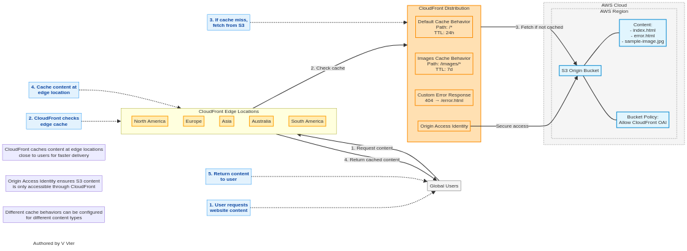

# Lab 19: CloudFront CDN - Global Content Delivery

*Authored by V Vier*

## Overview

Amazon CloudFront is a fast content delivery network (CDN) service that securely delivers data, videos, applications, and APIs to customers globally with low latency and high transfer speeds. This lab guides you through setting up a CloudFront distribution to serve content from an S3 bucket, configuring cache behaviors, implementing origin access identity for security, and testing the performance improvements.

## Architecture Diagram



## Prerequisites

- AWS account with administrator access
- Basic understanding of S3 buckets
- Basic knowledge of HTTP/HTTPS protocols
- Basic understanding of DNS concepts

## Lab Objectives

1. Create an S3 bucket to host website content
2. Upload sample content to the S3 bucket
3. Create a CloudFront distribution with the S3 bucket as the origin
4. Configure cache behaviors and security settings
5. Test the CloudFront distribution
6. Analyze performance improvements
7. Implement custom error pages and URL redirects

## Step 1: Create an S3 Bucket for Website Content

### AWS Console

1. Navigate to the S3 Dashboard in the AWS Management Console
2. Click "Create bucket"
3. Configure the bucket:
   - Bucket name: `cloudfront-lab-[your-unique-id]` (e.g., `cloudfront-lab-123456`)
   - AWS Region: Choose a region close to you
   - Block all public access: Keep all settings checked (we'll use CloudFront to serve content)
   - Bucket versioning: Disabled
   - Default encryption: Enable with Amazon S3-managed keys (SSE-S3)
   - Click "Create bucket"

### AWS CLI

```bash
# Create S3 bucket
aws s3 mb s3://cloudfront-lab-[your-unique-id] --region us-east-1

# Set default encryption
aws s3api put-bucket-encryption \
  --bucket cloudfront-lab-[your-unique-id] \
  --server-side-encryption-configuration '{
    "Rules": [
      {
        "ApplyServerSideEncryptionByDefault": {
          "SSEAlgorithm": "AES256"
        },
        "BucketKeyEnabled": true
      }
    ]
  }'
```

## Step 2: Create Sample Website Content

1. Create a simple HTML file named `index.html`:

```html
<!DOCTYPE html>
<html lang="en">
<head>
    <meta charset="UTF-8">
    <meta name="viewport" content="width=device-width, initial-scale=1.0">
    <title>CloudFront Lab</title>
    <style>
        body {
            font-family: Arial, sans-serif;
            max-width: 800px;
            margin: 0 auto;
            padding: 20px;
            line-height: 1.6;
        }
        h1 {
            color: #0066cc;
        }
        .container {
            border: 1px solid #ddd;
            padding: 20px;
            border-radius: 5px;
        }
        img {
            max-width: 100%;
            height: auto;
            display: block;
            margin: 20px 0;
        }
    </style>
</head>
<body>
    <div class="container">
        <h1>Welcome to the CloudFront CDN Lab</h1>
        <p>This page is being served through Amazon CloudFront from an S3 origin.</p>
        <p>Current time: <span id="current-time"></span></p>
        <p>Page loaded at: <span id="load-time"></span></p>
        
        <h2>Benefits of CloudFront</h2>
        <ul>
            <li>Improved latency for global users</li>
            <li>High transfer speeds</li>
            <li>Edge caching</li>
            <li>Integration with AWS Shield for DDoS protection</li>
            <li>Integration with AWS WAF for web application security</li>
        </ul>
        
        <h2>Sample Image</h2>
        
        
        <h2>Cache Test</h2>
        <p>This random number should remain the same if the page is cached: <span id="random-number"></span></p>
    </div>
    
    <script>
        document.getElementById('current-time').textContent = new Date().toLocaleString();
        document.getElementById('load-time').textContent = new Date().toLocaleString();
        document.getElementById('random-number').textContent = Math.floor(Math.random() * 1000000);
    </script>
</body>
</html>
```

2. Create an error page named `error.html`:

```html
<!DOCTYPE html>
<html lang="en">
<head>
    <meta charset="UTF-8">
    <meta name="viewport" content="width=device-width, initial-scale=1.0">
    <title>Error - CloudFront Lab</title>
    <style>
        body {
            font-family: Arial, sans-serif;
            max-width: 800px;
            margin: 0 auto;
            padding: 20px;
            line-height: 1.6;
            text-align: center;
        }
        h1 {
            color: #cc0000;
        }
        .container {
            border: 1px solid #ddd;
            padding: 20px;
            border-radius: 5px;
        }
    </style>
</head>
<body>
    <div class="container">
        <h1>Oops! Something went wrong</h1>
        <p>The page you're looking for doesn't exist or another error occurred.</p>
        <p>Please go back to the <a href="index.html">home page</a>.</p>
    </div>
</body>
</html>
```

3. Download a sample image or create one for the website

## Step 3: Upload Content to the S3 Bucket

### AWS Console

1. Navigate to the S3 bucket you created
2. Click "Upload"
3. Add the files you created: `index.html`, `error.html`, and your sample image
4. Click "Upload"

### AWS CLI

```bash
# Upload files to S3 bucket
aws s3 cp index.html s3://cloudfront-lab-[your-unique-id]/
aws s3 cp error.html s3://cloudfront-lab-[your-unique-id]/
aws s3 cp sample-image.jpg s3://cloudfront-lab-[your-unique-id]/
```

## Step 4: Create a CloudFront Origin Access Identity (OAI)

### AWS Console

1. Navigate to the CloudFront Dashboard in the AWS Management Console
2. In the left navigation pane, click "Origin access identities"
3. Click "Create origin access identity"
4. Enter a comment: `CloudFront Lab OAI`
5. Click "Create"
6. Note the OAI ID (e.g., `E1A2B3C4D5E6F7`)

### AWS CLI

```bash
# Create CloudFront Origin Access Identity
aws cloudfront create-cloud-front-origin-access-identity \
  --cloud-front-origin-access-identity-config "{\"CallerReference\":\"$(date +%s)\",\"Comment\":\"CloudFront Lab OAI\"}"

# Get the OAI ID and canonical user ID
OAI_ID=$(aws cloudfront list-cloud-front-origin-access-identities --query "CloudFrontOriginAccessIdentityList.Items[?Comment=='CloudFront Lab OAI'].Id" --output text)
OAI_S3_USER=$(aws cloudfront get-cloud-front-origin-access-identity --id $OAI_ID --query "CloudFrontOriginAccessIdentity.S3CanonicalUserId" --output text)
```

## Step 5: Update S3 Bucket Policy to Allow CloudFront Access

### AWS Console

1. Navigate to the S3 bucket you created
2. Click the "Permissions" tab
3. Under "Bucket policy", click "Edit"
4. Add the following policy (replace `[your-bucket-name]` and `[OAI-ID]` with your values):

```json
{
    "Version": "2012-10-17",
    "Statement": [
        {
            "Sid": "AllowCloudFrontServicePrincipal",
            "Effect": "Allow",
            "Principal": {
                "Service": "cloudfront.amazonaws.com"
            },
            "Action": "s3:GetObject",
            "Resource": "arn:aws:s3:::[your-bucket-name]/*",
            "Condition": {
                "StringEquals": {
                    "AWS:SourceArn": "arn:aws:cloudfront::[your-account-id]:distribution/[distribution-id]"
                }
            }
        }
    ]
}
```

5. Click "Save changes"

### AWS CLI

```bash
# Get your AWS account ID
ACCOUNT_ID=$(aws sts get-caller-identity --query "Account" --output text)

# Create a temporary policy file
cat > bucket-policy.json << EOF
{
    "Version": "2012-10-17",
    "Statement": [
        {
            "Sid": "AllowCloudFrontOAI",
            "Effect": "Allow",
            "Principal": {
                "AWS": "arn:aws:iam::cloudfront:user/CloudFront Origin Access Identity $OAI_ID"
            },
            "Action": "s3:GetObject",
            "Resource": "arn:aws:s3:::cloudfront-lab-[your-unique-id]/*"
        }
    ]
}
EOF

# Apply the bucket policy
aws s3api put-bucket-policy \
  --bucket cloudfront-lab-[your-unique-id] \
  --policy file://bucket-policy.json
```

## Step 6: Create a CloudFront Distribution

### AWS Console

1. Navigate to the CloudFront Dashboard in the AWS Management Console
2. Click "Create distribution"
3. Configure the distribution:
   - Origin domain: Select your S3 bucket
   - Origin path: Leave empty
   - Origin access: Select "Origin access identity" and choose the OAI you created
   - Viewer protocol policy: Redirect HTTP to HTTPS
   - Allowed HTTP methods: GET, HEAD
   - Cache policy: CachingOptimized
   - Origin request policy: CORS-S3Origin
   - Response headers policy: SimpleCORS
   - Default root object: index.html
   - Standard logging: Off
   - Custom error responses:
     - HTTP error code: 404 (Not Found)
     - Response page path: /error.html
     - HTTP response code: 404
   - Click "Create distribution"

### AWS CLI

```bash
# Create CloudFront distribution
aws cloudfront create-distribution \
  --origin-domain-name cloudfront-lab-[your-unique-id].s3.amazonaws.com \
  --default-root-object index.html \
  --origins "[{\"Id\":\"S3-cloudfront-lab-[your-unique-id]\",\"DomainName\":\"cloudfront-lab-[your-unique-id].s3.amazonaws.com\",\"S3OriginConfig\":{\"OriginAccessIdentity\":\"origin-access-identity/cloudfront/$OAI_ID\"}}]" \
  --default-cache-behavior "{\"TargetOriginId\":\"S3-cloudfront-lab-[your-unique-id]\",\"ViewerProtocolPolicy\":\"redirect-to-https\",\"AllowedMethods\":{\"Quantity\":2,\"Items\":[\"GET\",\"HEAD\"]},\"CachedMethods\":{\"Quantity\":2,\"Items\":[\"GET\",\"HEAD\"]},\"ForwardedValues\":{\"QueryString\":false,\"Cookies\":{\"Forward\":\"none\"}}}" \
  --custom-error-responses "[{\"ErrorCode\":404,\"ResponsePagePath\":\"/error.html\",\"ResponseCode\":404,\"ErrorCachingMinTTL\":30}]" \
  --comment "CloudFront Lab Distribution"

# Get the distribution ID and domain name
DIST_ID=$(aws cloudfront list-distributions --query "DistributionList.Items[?Comment=='CloudFront Lab Distribution'].Id" --output text)
DIST_DOMAIN=$(aws cloudfront list-distributions --query "DistributionList.Items[?Comment=='CloudFront Lab Distribution'].DomainName" --output text)
```

## Step 7: Wait for the CloudFront Distribution to Deploy

1. CloudFront distributions can take 5-10 minutes to deploy
2. Wait until the Status changes from "In Progress" to "Deployed"

## Step 8: Test the CloudFront Distribution

1. Once the distribution is deployed, note the domain name (e.g., `d1234abcdef.cloudfront.net`)
2. Open a web browser and navigate to `https://[your-distribution-domain]/index.html`
3. You should see the website you created, now served through CloudFront
4. Test the error page by navigating to a non-existent page: `https://[your-distribution-domain]/nonexistent.html`

## Step 9: Analyze Performance

1. Open the browser's developer tools (F12 or right-click and select "Inspect")
2. Go to the Network tab
3. Reload the page and observe the loading times
4. Note the `X-Cache` header in the response headers:
   - `Miss from cloudfront` indicates the content was not in the cache and was fetched from the origin
   - `Hit from cloudfront` indicates the content was served from the CloudFront cache
5. Reload the page multiple times and observe how the `X-Cache` header changes to `Hit from cloudfront`
6. Compare the loading times between the first load (cache miss) and subsequent loads (cache hits)

## Step 10: Configure Cache Behaviors (Optional)

### AWS Console

1. Navigate to the CloudFront Dashboard in the AWS Management Console
2. Click on your distribution ID
3. Go to the "Behaviors" tab
4. Click "Create behavior"
5. Configure the behavior:
   - Path pattern: `/images/*`
   - Origin: Your S3 bucket
   - Viewer protocol policy: Redirect HTTP to HTTPS
   - Allowed HTTP methods: GET, HEAD
   - Cache policy: CachingOptimized
   - Origin request policy: CORS-S3Origin
   - Response headers policy: SimpleCORS
   - Click "Create"

### AWS CLI

```bash
# Create cache behavior for images
aws cloudfront create-cache-behavior \
  --distribution-id $DIST_ID \
  --path-pattern "/images/*" \
  --target-origin-id "S3-cloudfront-lab-[your-unique-id]" \
  --viewer-protocol-policy "redirect-to-https" \
  --allowed-methods "GET" "HEAD" \
  --cached-methods "GET" "HEAD" \
  --forwarded-values "{\"QueryString\":false,\"Cookies\":{\"Forward\":\"none\"}}" \
  --min-ttl 86400 \
  --default-ttl 86400 \
  --max-ttl 31536000
```

## Step 11: Implement Cache Invalidation

### AWS Console

1. Navigate to the CloudFront Dashboard in the AWS Management Console
2. Click on your distribution ID
3. Go to the "Invalidations" tab
4. Click "Create invalidation"
5. Enter the paths to invalidate (e.g., `/index.html` or `/*` for all files)
6. Click "Create invalidation"

### AWS CLI

```bash
# Create cache invalidation
aws cloudfront create-invalidation \
  --distribution-id $DIST_ID \
  --paths "/index.html" "/error.html"
```

## Cleanup

To avoid incurring charges, delete the resources created in this lab:

### AWS Console

1. Navigate to the CloudFront Dashboard in the AWS Management Console
2. Select your distribution
3. Click "Disable" and wait for the status to change to "Disabled"
4. Click "Delete" and confirm the deletion
5. Navigate to the S3 Dashboard
6. Select your bucket
7. Click "Empty" to delete all objects
8. Click "Delete" to delete the bucket

### AWS CLI

```bash
# Disable CloudFront distribution
aws cloudfront update-distribution \
  --id $DIST_ID \
  --if-match $(aws cloudfront get-distribution --id $DIST_ID --query "ETag" --output text) \
  --distribution-config "$(aws cloudfront get-distribution-config --id $DIST_ID --query "DistributionConfig" | sed 's/"Enabled": true/"Enabled": false/')"

# Wait for distribution to be disabled (this can take 5-15 minutes)
echo "Waiting for CloudFront distribution to be disabled..."
aws cloudfront wait distribution-deployed --id $DIST_ID

# Delete CloudFront distribution
aws cloudfront delete-distribution \
  --id $DIST_ID \
  --if-match $(aws cloudfront get-distribution --id $DIST_ID --query "ETag" --output text)

# Delete CloudFront Origin Access Identity
aws cloudfront delete-cloud-front-origin-access-identity \
  --id $OAI_ID \
  --if-match $(aws cloudfront get-cloud-front-origin-access-identity --id $OAI_ID --query "ETag" --output text)

# Empty S3 bucket
aws s3 rm s3://cloudfront-lab-[your-unique-id] --recursive

# Delete S3 bucket
aws s3 rb s3://cloudfront-lab-[your-unique-id] --force
```

## Conclusion

In this lab, you learned how to:
- Create an S3 bucket to host website content
- Set up a CloudFront distribution with an S3 origin
- Configure Origin Access Identity for secure access to S3 content
- Implement custom error pages
- Configure cache behaviors for different content types
- Test and analyze CloudFront performance
- Perform cache invalidation

Amazon CloudFront is a powerful CDN service that helps deliver content with low latency and high transfer speeds to users around the world. By caching content at edge locations close to your users, CloudFront reduces the load on your origin servers and improves the user experience.

## Next Steps

- Implement custom domain names with SSL/TLS certificates using AWS Certificate Manager
- Configure geo-restriction to control access to your content based on user location
- Set up CloudFront Functions or Lambda@Edge for advanced functionality
- Implement field-level encryption for sensitive data
- Configure real-time logs with Amazon Kinesis Data Streams
- Explore AWS WAF integration for web application security
