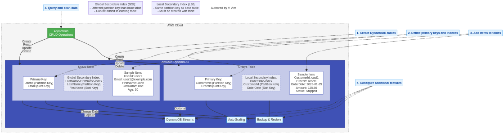

# Lab 20: DynamoDB Basics - NoSQL Database Operations

*Authored by V Vier*

## Overview

Amazon DynamoDB is a fully managed NoSQL database service that provides fast and predictable performance with seamless scalability. This lab guides you through the basics of DynamoDB, including creating tables, defining primary keys, adding data, querying and scanning data, and implementing basic access patterns.

## Architecture Diagram



## Prerequisites

- AWS account with administrator access
- Basic understanding of database concepts
- Basic knowledge of JSON data format
- AWS CLI installed and configured (optional for CLI examples)

## Lab Objectives

1. Create a DynamoDB table with appropriate primary key design
2. Add, update, and delete items in the table
3. Query and scan data using different access patterns
4. Implement secondary indexes for flexible querying
5. Configure auto scaling for read and write capacity
6. Use DynamoDB Streams to capture changes
7. Implement basic backup and restore operations

## Step 1: Create a DynamoDB Table

### AWS Console

1. Navigate to the DynamoDB Dashboard in the AWS Management Console
2. Click "Create table"
3. Configure the table:
   - Table name: `Users`
   - Partition key: `UserId` (String)
   - Sort key: `Email` (String)
   - Table settings: Select "Customize settings"
   - Read/write capacity mode: Select "Provisioned"
   - Provisioned capacity:
     - Read capacity units: 5
     - Write capacity units: 5
   - Enable auto scaling: Check the box
     - Minimum capacity units: 5
     - Maximum capacity units: 20
     - Target utilization: 70%
   - Encryption: Default (AWS owned key)
   - Click "Create table"

### AWS CLI

```bash
# Create DynamoDB table
aws dynamodb create-table \
  --table-name Users \
  --attribute-definitions \
    AttributeName=UserId,AttributeType=S \
    AttributeName=Email,AttributeType=S \
  --key-schema \
    AttributeName=UserId,KeyType=HASH \
    AttributeName=Email,KeyType=RANGE \
  --provisioned-throughput ReadCapacityUnits=5,WriteCapacityUnits=5 \
  --tags Key=Environment,Value=Lab

# Configure auto scaling for read capacity
aws application-autoscaling register-scalable-target \
  --service-namespace dynamodb \
  --resource-id "table/Users" \
  --scalable-dimension "dynamodb:table:ReadCapacityUnits" \
  --min-capacity 5 \
  --max-capacity 20

aws application-autoscaling put-scaling-policy \
  --service-namespace dynamodb \
  --resource-id "table/Users" \
  --scalable-dimension "dynamodb:table:ReadCapacityUnits" \
  --policy-name "DynamoDBReadCapacityUtilization:Users" \
  --policy-type "TargetTrackingScaling" \
  --target-tracking-scaling-policy-configuration '{
    "PredefinedMetricSpecification": {
      "PredefinedMetricType": "DynamoDBReadCapacityUtilization"
    },
    "ScaleOutCooldown": 60,
    "ScaleInCooldown": 60,
    "TargetValue": 70.0
  }'

# Configure auto scaling for write capacity
aws application-autoscaling register-scalable-target \
  --service-namespace dynamodb \
  --resource-id "table/Users" \
  --scalable-dimension "dynamodb:table:WriteCapacityUnits" \
  --min-capacity 5 \
  --max-capacity 20

aws application-autoscaling put-scaling-policy \
  --service-namespace dynamodb \
  --resource-id "table/Users" \
  --scalable-dimension "dynamodb:table:WriteCapacityUnits" \
  --policy-name "DynamoDBWriteCapacityUtilization:Users" \
  --policy-type "TargetTrackingScaling" \
  --target-tracking-scaling-policy-configuration '{
    "PredefinedMetricSpecification": {
      "PredefinedMetricType": "DynamoDBWriteCapacityUtilization"
    },
    "ScaleOutCooldown": 60,
    "ScaleInCooldown": 60,
    "TargetValue": 70.0
  }'
```

## Step 2: Add Items to the Table

### AWS Console

1. Navigate to the DynamoDB Dashboard in the AWS Management Console
2. Click "Tables" in the left navigation pane
3. Select the `Users` table
4. Click the "Explore table items" button
5. Click "Create item"
6. Add the following attributes:
   - UserId: "user1" (String)
   - Email: "user1@example.com" (String)
   - FirstName: "John" (String)
   - LastName: "Doe" (String)
   - Age: 30 (Number)
   - Address: (Map)
     - Street: "123 Main St" (String)
     - City: "Seattle" (String)
     - State: "WA" (String)
     - ZipCode: "98101" (String)
   - PhoneNumbers: (List)
     - "555-123-4567" (String)
     - "555-987-6543" (String)
7. Click "Create item"
8. Repeat the process to add more users with different attributes

### AWS CLI

```bash
# Add an item to the table
aws dynamodb put-item \
  --table-name Users \
  --item '{
    "UserId": {"S": "user1"},
    "Email": {"S": "user1@example.com"},
    "FirstName": {"S": "John"},
    "LastName": {"S": "Doe"},
    "Age": {"N": "30"},
    "Address": {
      "M": {
        "Street": {"S": "123 Main St"},
        "City": {"S": "Seattle"},
        "State": {"S": "WA"},
        "ZipCode": {"S": "98101"}
      }
    },
    "PhoneNumbers": {
      "L": [
        {"S": "555-123-4567"},
        {"S": "555-987-6543"}
      ]
    }
  }'

# Add another item
aws dynamodb put-item \
  --table-name Users \
  --item '{
    "UserId": {"S": "user2"},
    "Email": {"S": "user2@example.com"},
    "FirstName": {"S": "Jane"},
    "LastName": {"S": "Smith"},
    "Age": {"N": "25"},
    "Address": {
      "M": {
        "Street": {"S": "456 Oak Ave"},
        "City": {"S": "Portland"},
        "State": {"S": "OR"},
        "ZipCode": {"S": "97201"}
      }
    },
    "PhoneNumbers": {
      "L": [
        {"S": "555-555-5555"}
      ]
    }
  }'

# Add another item
aws dynamodb put-item \
  --table-name Users \
  --item '{
    "UserId": {"S": "user3"},
    "Email": {"S": "user3@example.com"},
    "FirstName": {"S": "Bob"},
    "LastName": {"S": "Johnson"},
    "Age": {"N": "42"},
    "Address": {
      "M": {
        "Street": {"S": "789 Pine St"},
        "City": {"S": "Seattle"},
        "State": {"S": "WA"},
        "ZipCode": {"S": "98102"}
      }
    },
    "PhoneNumbers": {
      "L": [
        {"S": "555-111-2222"},
        {"S": "555-333-4444"}
      ]
    }
  }'
```

## Step 3: Query Data Using Primary Key

### AWS Console

1. Navigate to the DynamoDB Dashboard in the AWS Management Console
2. Click "Tables" in the left navigation pane
3. Select the `Users` table
4. Click the "Explore table items" button
5. Click "Query"
6. Configure the query:
   - Partition key: "user1"
   - Click "Run"
7. View the results

### AWS CLI

```bash
# Query for a specific user
aws dynamodb query \
  --table-name Users \
  --key-condition-expression "UserId = :userId" \
  --expression-attribute-values '{
    ":userId": {"S": "user1"}
  }'
```

## Step 4: Update an Item

### AWS Console

1. Navigate to the DynamoDB Dashboard in the AWS Management Console
2. Click "Tables" in the left navigation pane
3. Select the `Users` table
4. Click the "Explore table items" button
5. Find and select the item with UserId "user1"
6. Click "Actions" > "Edit item"
7. Update the Age attribute to 31
8. Add a new attribute: "IsActive" (Boolean) with value "true"
9. Click "Save changes"

### AWS CLI

```bash
# Update an item
aws dynamodb update-item \
  --table-name Users \
  --key '{
    "UserId": {"S": "user1"},
    "Email": {"S": "user1@example.com"}
  }' \
  --update-expression "SET Age = :age, IsActive = :active" \
  --expression-attribute-values '{
    ":age": {"N": "31"},
    ":active": {"BOOL": true}
  }' \
  --return-values ALL_NEW
```

## Step 5: Create a Global Secondary Index (GSI)

### AWS Console

1. Navigate to the DynamoDB Dashboard in the AWS Management Console
2. Click "Tables" in the left navigation pane
3. Select the `Users` table
4. Go to the "Indexes" tab
5. Click "Create index"
6. Configure the index:
   - Partition key: `LastName` (String)
   - Sort key: `FirstName` (String)
   - Index name: `LastName-FirstName-index`
   - Projected attributes: All
   - Click "Create index"
7. Wait for the index to be created (this may take a few minutes)

### AWS CLI

```bash
# Create a global secondary index
aws dynamodb update-table \
  --table-name Users \
  --attribute-definitions \
    AttributeName=LastName,AttributeType=S \
    AttributeName=FirstName,AttributeType=S \
  --global-secondary-index-updates '[
    {
      "Create": {
        "IndexName": "LastName-FirstName-index",
        "KeySchema": [
          {"AttributeName": "LastName", "KeyType": "HASH"},
          {"AttributeName": "FirstName", "KeyType": "RANGE"}
        ],
        "Projection": {
          "ProjectionType": "ALL"
        },
        "ProvisionedThroughput": {
          "ReadCapacityUnits": 5,
          "WriteCapacityUnits": 5
        }
      }
    }
  ]'
```

## Step 6: Query Using the Global Secondary Index

### AWS Console

1. Navigate to the DynamoDB Dashboard in the AWS Management Console
2. Click "Tables" in the left navigation pane
3. Select the `Users` table
4. Click the "Explore table items" button
5. Click "Query"
6. Select the index "LastName-FirstName-index" from the dropdown
7. Configure the query:
   - Partition key: "Doe"
   - Click "Run"
8. View the results

### AWS CLI

```bash
# Query using the global secondary index
aws dynamodb query \
  --table-name Users \
  --index-name LastName-FirstName-index \
  --key-condition-expression "LastName = :lastName" \
  --expression-attribute-values '{
    ":lastName": {"S": "Doe"}
  }'
```

## Step 7: Create a Local Secondary Index (LSI)

> **Note**: Local Secondary Indexes must be created when the table is created. You cannot add an LSI to an existing table.

Let's create a new table with an LSI:

### AWS Console

1. Navigate to the DynamoDB Dashboard in the AWS Management Console
2. Click "Create table"
3. Configure the table:
   - Table name: `Orders`
   - Partition key: `CustomerId` (String)
   - Sort key: `OrderId` (String)
   - Table settings: Select "Customize settings"
   - Create a Local Secondary Index:
     - Click "Add index"
     - Sort key: `OrderDate` (String)
     - Index name: `OrderDate-index`
     - Projected attributes: All
   - Read/write capacity mode: Select "Provisioned"
   - Provisioned capacity:
     - Read capacity units: 5
     - Write capacity units: 5
   - Click "Create table"

### AWS CLI

```bash
# Create a table with a local secondary index
aws dynamodb create-table \
  --table-name Orders \
  --attribute-definitions \
    AttributeName=CustomerId,AttributeType=S \
    AttributeName=OrderId,AttributeType=S \
    AttributeName=OrderDate,AttributeType=S \
  --key-schema \
    AttributeName=CustomerId,KeyType=HASH \
    AttributeName=OrderId,KeyType=RANGE \
  --local-secondary-indexes '[
    {
      "IndexName": "OrderDate-index",
      "KeySchema": [
        {"AttributeName": "CustomerId", "KeyType": "HASH"},
        {"AttributeName": "OrderDate", "KeyType": "RANGE"}
      ],
      "Projection": {
        "ProjectionType": "ALL"
      }
    }
  ]' \
  --provisioned-throughput ReadCapacityUnits=5,WriteCapacityUnits=5
```

## Step 8: Add Items to the Orders Table

### AWS Console

1. Navigate to the DynamoDB Dashboard in the AWS Management Console
2. Click "Tables" in the left navigation pane
3. Select the `Orders` table
4. Click the "Explore table items" button
5. Click "Create item"
6. Add the following attributes:
   - CustomerId: "cust1" (String)
   - OrderId: "order1" (String)
   - OrderDate: "2023-01-15" (String)
   - Amount: 125.50 (Number)
   - Status: "Shipped" (String)
7. Click "Create item"
8. Repeat the process to add more orders with different attributes

### AWS CLI

```bash
# Add items to the Orders table
aws dynamodb put-item \
  --table-name Orders \
  --item '{
    "CustomerId": {"S": "cust1"},
    "OrderId": {"S": "order1"},
    "OrderDate": {"S": "2023-01-15"},
    "Amount": {"N": "125.50"},
    "Status": {"S": "Shipped"}
  }'

aws dynamodb put-item \
  --table-name Orders \
  --item '{
    "CustomerId": {"S": "cust1"},
    "OrderId": {"S": "order2"},
    "OrderDate": {"S": "2023-02-20"},
    "Amount": {"N": "75.25"},
    "Status": {"S": "Delivered"}
  }'

aws dynamodb put-item \
  --table-name Orders \
  --item '{
    "CustomerId": {"S": "cust2"},
    "OrderId": {"S": "order3"},
    "OrderDate": {"S": "2023-01-30"},
    "Amount": {"N": "200.00"},
    "Status": {"S": "Processing"}
  }'
```

## Step 9: Query Using the Local Secondary Index

### AWS Console

1. Navigate to the DynamoDB Dashboard in the AWS Management Console
2. Click "Tables" in the left navigation pane
3. Select the `Orders` table
4. Click the "Explore table items" button
5. Click "Query"
6. Configure the query:
   - Partition key: "cust1"
   - Select the index "OrderDate-index" from the dropdown
   - Add sort key condition: "begins_with" "2023-01"
   - Click "Run"
7. View the results

### AWS CLI

```bash
# Query using the local secondary index
aws dynamodb query \
  --table-name Orders \
  --index-name OrderDate-index \
  --key-condition-expression "CustomerId = :custId AND begins_with(OrderDate, :date)" \
  --expression-attribute-values '{
    ":custId": {"S": "cust1"},
    ":date": {"S": "2023-01"}
  }'
```

## Step 10: Enable DynamoDB Streams

### AWS Console

1. Navigate to the DynamoDB Dashboard in the AWS Management Console
2. Click "Tables" in the left navigation pane
3. Select the `Users` table
4. Go to the "Exports and streams" tab
5. Under "DynamoDB stream details", click "Enable"
6. Select "New and old images" for the view type
7. Click "Enable stream"

### AWS CLI

```bash
# Enable DynamoDB Streams
aws dynamodb update-table \
  --table-name Users \
  --stream-specification StreamEnabled=true,StreamViewType=NEW_AND_OLD_IMAGES
```

## Step 11: Create a Backup

### AWS Console

1. Navigate to the DynamoDB Dashboard in the AWS Management Console
2. Click "Tables" in the left navigation pane
3. Select the `Users` table
4. Go to the "Backups" tab
5. Click "Create backup"
6. Enter a backup name: `Users-Backup-[YYYY-MM-DD]`
7. Click "Create backup"

### AWS CLI

```bash
# Create a backup
aws dynamodb create-backup \
  --table-name Users \
  --backup-name "Users-Backup-$(date +%Y-%m-%d)"
```

## Step 12: Delete an Item

### AWS Console

1. Navigate to the DynamoDB Dashboard in the AWS Management Console
2. Click "Tables" in the left navigation pane
3. Select the `Users` table
4. Click the "Explore table items" button
5. Find and select the item with UserId "user3"
6. Click "Actions" > "Delete item"
7. Click "Delete"

### AWS CLI

```bash
# Delete an item
aws dynamodb delete-item \
  --table-name Users \
  --key '{
    "UserId": {"S": "user3"},
    "Email": {"S": "user3@example.com"}
  }'
```

## Step 13: Scan the Table

### AWS Console

1. Navigate to the DynamoDB Dashboard in the AWS Management Console
2. Click "Tables" in the left navigation pane
3. Select the `Users` table
4. Click the "Explore table items" button
5. Click "Scan"
6. Add a filter expression (optional):
   - Attribute: "Age"
   - Condition: ">"
   - Value: 25
7. Click "Run"
8. View the results

### AWS CLI

```bash
# Scan the table
aws dynamodb scan \
  --table-name Users

# Scan with a filter expression
aws dynamodb scan \
  --table-name Users \
  --filter-expression "Age > :age" \
  --expression-attribute-values '{
    ":age": {"N": "25"}
  }'
```

## Step 14: Use Batch Operations

### AWS CLI

```bash
# Batch write items
aws dynamodb batch-write-item \
  --request-items '{
    "Users": [
      {
        "PutRequest": {
          "Item": {
            "UserId": {"S": "user4"},
            "Email": {"S": "user4@example.com"},
            "FirstName": {"S": "Alice"},
            "LastName": {"S": "Brown"},
            "Age": {"N": "28"}
          }
        }
      },
      {
        "PutRequest": {
          "Item": {
            "UserId": {"S": "user5"},
            "Email": {"S": "user5@example.com"},
            "FirstName": {"S": "Charlie"},
            "LastName": {"S": "Davis"},
            "Age": {"N": "35"}
          }
        }
      }
    ]
  }'

# Batch get items
aws dynamodb batch-get-item \
  --request-items '{
    "Users": {
      "Keys": [
        {
          "UserId": {"S": "user1"},
          "Email": {"S": "user1@example.com"}
        },
        {
          "UserId": {"S": "user2"},
          "Email": {"S": "user2@example.com"}
        }
      ]
    }
  }'
```

## Step 15: Use Conditional Writes

### AWS CLI

```bash
# Update an item only if a condition is met
aws dynamodb update-item \
  --table-name Users \
  --key '{
    "UserId": {"S": "user1"},
    "Email": {"S": "user1@example.com"}
  }' \
  --update-expression "SET Age = :newAge" \
  --condition-expression "Age = :currentAge" \
  --expression-attribute-values '{
    ":newAge": {"N": "32"},
    ":currentAge": {"N": "31"}
  }' \
  --return-values ALL_NEW
```

## Cleanup

To avoid incurring charges, delete the resources created in this lab:

### AWS Console

1. Navigate to the DynamoDB Dashboard in the AWS Management Console
2. Click "Tables" in the left navigation pane
3. Select the `Users` table
4. Click "Delete"
5. Type "delete" in the confirmation field
6. Click "Delete"
7. Repeat the process for the `Orders` table

### AWS CLI

```bash
# Delete the tables
aws dynamodb delete-table --table-name Users
aws dynamodb delete-table --table-name Orders

# Delete the backups (optional)
aws dynamodb list-backups --output text | grep Users-Backup | awk '{print $3}' | xargs -I {} aws dynamodb delete-backup --backup-arn {}
```

## Conclusion

In this lab, you learned how to:
- Create DynamoDB tables with appropriate primary key design
- Add, update, and delete items in DynamoDB tables
- Query and scan data using different access patterns
- Implement secondary indexes for flexible querying
- Configure auto scaling for read and write capacity
- Enable DynamoDB Streams to capture changes
- Create backups of DynamoDB tables
- Use batch operations and conditional writes

Amazon DynamoDB is a powerful NoSQL database service that provides fast and predictable performance with seamless scalability. It's ideal for applications that need consistent, single-digit millisecond latency at any scale.

## Next Steps

- Learn about DynamoDB Accelerator (DAX) for caching
- Explore DynamoDB Transactions for atomic operations
- Implement Time to Live (TTL) for automatic item expiration
- Use DynamoDB Streams with AWS Lambda for event-driven architectures
- Explore DynamoDB Global Tables for multi-region replication
- Implement fine-grained access control with IAM policies
