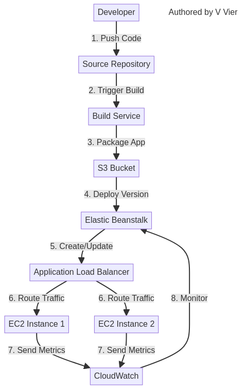

# Lab 21: Elastic Beanstalk Deployment - Simplified Application Hosting

*Authored by V Vier*

## Overview

AWS Elastic Beanstalk is a fully managed service that makes it easy to deploy and run applications in multiple languages without worrying about the underlying infrastructure. This lab guides you through deploying a web application using Elastic Beanstalk, configuring environment settings, implementing CI/CD, and monitoring your application.

## Architecture Diagram



## Prerequisites

- AWS account with administrator access
- Basic understanding of web applications
- Git installed locally
- Sample application code (provided in this lab)
- AWS CLI installed and configured (optional for CLI examples)

## Lab Objectives

1. Create an Elastic Beanstalk application and environment
2. Deploy a sample web application
3. Configure environment settings and scaling options
4. Implement environment variables and configuration files
5. Set up monitoring and logging
6. Implement deployment strategies (rolling, immutable)
7. Create a CI/CD pipeline for automated deployments

## Step 1: Create an Elastic Beanstalk Application

### AWS Console

1. Navigate to the Elastic Beanstalk Dashboard in the AWS Management Console
2. Click "Create application"
3. Configure the application:
   - Application name: `MyWebApp`
   - Tags (optional): Add tags like `Environment=Lab`
4. Click "Create"

### AWS CLI

```bash
# Create an Elastic Beanstalk application
aws elasticbeanstalk create-application \
  --application-name MyWebApp \
  --tags Key=Environment,Value=Lab
```

## Step 2: Prepare the Sample Application

Let's create a simple Node.js application for deployment.

### Create Application Files

Create a new directory for your application and add the following files:

```bash
# Create application directory
mkdir my-web-app
cd my-web-app

# Create package.json
cat > package.json << 'EOF'
{
  "name": "my-web-app",
  "version": "1.0.0",
  "description": "Sample application for Elastic Beanstalk",
  "main": "app.js",
  "scripts": {
    "start": "node app.js"
  },
  "dependencies": {
    "express": "^4.17.1"
  }
}
EOF

# Create app.js
cat > app.js << 'EOF'
const express = require('express');
const app = express();
const port = process.env.PORT || 3000;

// Environment variables
const environment = process.env.NODE_ENV || 'development';
const appVersion = process.env.APP_VERSION || '1.0.0';

// Routes
app.get('/', (req, res) => {
  res.send(`
    <html>
      <head>
        <title>Elastic Beanstalk Demo</title>
        <style>
          body {
            font-family: Arial, sans-serif;
            margin: 40px;
            line-height: 1.6;
          }
          h1 {
            color: #0066cc;
          }
          .container {
            max-width: 800px;
            margin: 0 auto;
            padding: 20px;
            border: 1px solid #ddd;
            border-radius: 5px;
          }
          .info {
            background-color: #f8f9fa;
            padding: 15px;
            border-radius: 5px;
            margin-top: 20px;
          }
        </style>
      </head>
      <body>
        <div class="container">
          <h1>Hello from AWS Elastic Beanstalk!</h1>
          <p>This is a sample application deployed using AWS Elastic Beanstalk.</p>
          <div class="info">
            <p><strong>Environment:</strong> ${environment}</p>
            <p><strong>Application Version:</strong> ${appVersion}</p>
            <p><strong>Server Time:</strong> ${new Date().toLocaleString()}</p>
          </div>
        </div>
      </body>
    </html>
  `);
});

app.get('/health', (req, res) => {
  res.status(200).json({ status: 'healthy' });
});

// Start server
app.listen(port, () => {
  console.log(`Server running on port ${port}`);
});
EOF

# Create .ebignore file
cat > .ebignore << 'EOF'
node_modules
.git
.gitignore
.ebignore
EOF

# Create Elastic Beanstalk configuration
mkdir -p .ebextensions
cat > .ebextensions/options.config << 'EOF'
option_settings:
  aws:elasticbeanstalk:application:environment:
    NODE_ENV: production
    APP_VERSION: 1.0.0
  aws:elasticbeanstalk:container:nodejs:
    NodeVersion: 16.x
  aws:autoscaling:asg:
    MinSize: 2
    MaxSize: 4
  aws:elasticbeanstalk:environment:proxy:staticfiles:
    /static: /static
EOF

# Create Procfile
cat > Procfile << 'EOF'
web: npm start
EOF

# Initialize npm and install dependencies
npm install
```

### Initialize Git Repository

```bash
# Initialize Git repository
git init
git add .
git commit -m "Initial commit"
```

## Step 3: Create an Elastic Beanstalk Environment

### AWS Console

1. In the Elastic Beanstalk Dashboard, select your application (`MyWebApp`)
2. Click "Create environment"
3. Select "Web server environment"
4. Configure the environment:
   - Environment name: `MyWebApp-Env`
   - Domain: Leave as default or customize
   - Platform: Node.js
   - Platform branch: Node.js 16
   - Platform version: Recommended
   - Application code: Upload your code (zip the my-web-app directory)
5. Click "Configure more options"
6. Modify the following configuration presets:
   - Instances:
     - Instance type: t2.micro
     - Root volume: General Purpose (SSD), 10 GB
   - Capacity:
     - Environment type: Load balanced
     - Min instances: 2
     - Max instances: 4
     - Instance type: t2.micro
     - Scaling triggers: Target CPU utilization 70%
   - Load Balancer:
     - Type: Application Load Balancer
     - Add listener: HTTP on port 80
     - Health check path: /health
   - Security:
     - Service role: aws-elasticbeanstalk-service-role
     - EC2 key pair: Create or select existing
   - Monitoring:
     - System: Enhanced
     - Health reporting: Enhanced
7. Click "Create environment"

### AWS CLI

```bash
# Create an Elastic Beanstalk environment
# First, create a zip file of your application
cd my-web-app
zip -r ../my-web-app.zip .
cd ..

# Create the environment
aws elasticbeanstalk create-environment \
  --application-name MyWebApp \
  --environment-name MyWebApp-Env \
  --solution-stack-name "64bit Amazon Linux 2 v5.5.0 running Node.js 16" \
  --option-settings file://option-settings.json \
  --version-label v1 \
  --description "Production environment for MyWebApp" \
  --tier "Name=WebServer,Type=Standard" \
  --version-label v1

# Note: You'll need to create an option-settings.json file with your configuration
# or use the --option-settings parameter with inline JSON
```

Example `option-settings.json`:

```json
[
  {
    "Namespace": "aws:elasticbeanstalk:application:environment",
    "OptionName": "NODE_ENV",
    "Value": "production"
  },
  {
    "Namespace": "aws:elasticbeanstalk:application:environment",
    "OptionName": "APP_VERSION",
    "Value": "1.0.0"
  },
  {
    "Namespace": "aws:autoscaling:asg",
    "OptionName": "MinSize",
    "Value": "2"
  },
  {
    "Namespace": "aws:autoscaling:asg",
    "OptionName": "MaxSize",
    "Value": "4"
  },
  {
    "Namespace": "aws:autoscaling:trigger",
    "OptionName": "MeasureName",
    "Value": "CPUUtilization"
  },
  {
    "Namespace": "aws:autoscaling:trigger",
    "OptionName": "Statistic",
    "Value": "Average"
  },
  {
    "Namespace": "aws:autoscaling:trigger",
    "OptionName": "Unit",
    "Value": "Percent"
  },
  {
    "Namespace": "aws:autoscaling:trigger",
    "OptionName": "UpperThreshold",
    "Value": "70"
  },
  {
    "Namespace": "aws:autoscaling:trigger",
    "OptionName": "LowerThreshold",
    "Value": "30"
  },
  {
    "Namespace": "aws:elasticbeanstalk:environment",
    "OptionName": "LoadBalancerType",
    "Value": "application"
  },
  {
    "Namespace": "aws:elasticbeanstalk:environment:process:default",
    "OptionName": "HealthCheckPath",
    "Value": "/health"
  },
  {
    "Namespace": "aws:elasticbeanstalk:environment:process:default",
    "OptionName": "Port",
    "Value": "3000"
  },
  {
    "Namespace": "aws:elasticbeanstalk:healthreporting:system",
    "OptionName": "SystemType",
    "Value": "enhanced"
  }
]
```

## Step 4: Deploy the Application

### AWS Console

1. In the Elastic Beanstalk Dashboard, select your environment (`MyWebApp-Env`)
2. Click "Upload and deploy"
3. Choose the zip file of your application
4. Enter a version label: `v1`
5. Click "Deploy"

### AWS CLI

```bash
# Create an application version
aws elasticbeanstalk create-application-version \
  --application-name MyWebApp \
  --version-label v1 \
  --source-bundle S3Bucket="your-bucket",S3Key="my-web-app.zip" \
  --auto-create-application

# Deploy the application version
aws elasticbeanstalk update-environment \
  --application-name MyWebApp \
  --environment-name MyWebApp-Env \
  --version-label v1
```

## Step 5: Configure Environment Variables

### AWS Console

1. In the Elastic Beanstalk Dashboard, select your environment (`MyWebApp-Env`)
2. Click "Configuration"
3. In the "Software" category, click "Edit"
4. Under "Environment properties", add the following:
   - Key: `APP_VERSION`, Value: `1.1.0`
   - Key: `CUSTOM_SETTING`, Value: `Hello from Elastic Beanstalk!`
5. Click "Apply"

### AWS CLI

```bash
# Update environment properties
aws elasticbeanstalk update-environment \
  --application-name MyWebApp \
  --environment-name MyWebApp-Env \
  --option-settings '[
    {
      "Namespace": "aws:elasticbeanstalk:application:environment",
      "OptionName": "APP_VERSION",
      "Value": "1.1.0"
    },
    {
      "Namespace": "aws:elasticbeanstalk:application:environment",
      "OptionName": "CUSTOM_SETTING",
      "Value": "Hello from Elastic Beanstalk!"
    }
  ]'
```

## Step 6: Configure Auto Scaling

### AWS Console

1. In the Elastic Beanstalk Dashboard, select your environment (`MyWebApp-Env`)
2. Click "Configuration"
3. In the "Capacity" category, click "Edit"
4. Configure the following:
   - Auto Scaling Group:
     - Min instances: 2
     - Max instances: 6
   - Scaling triggers:
     - Metric: CPUUtilization
     - Statistic: Average
     - Unit: Percent
     - Period: 5 minutes
     - Breach duration: 5 minutes
     - Upper threshold: 70
     - Upper breach scale increment: 1
     - Lower threshold: 30
     - Lower breach scale increment: -1
5. Click "Apply"

### AWS CLI

```bash
# Update auto scaling configuration
aws elasticbeanstalk update-environment \
  --application-name MyWebApp \
  --environment-name MyWebApp-Env \
  --option-settings '[
    {
      "Namespace": "aws:autoscaling:asg",
      "OptionName": "MinSize",
      "Value": "2"
    },
    {
      "Namespace": "aws:autoscaling:asg",
      "OptionName": "MaxSize",
      "Value": "6"
    },
    {
      "Namespace": "aws:autoscaling:trigger",
      "OptionName": "MeasureName",
      "Value": "CPUUtilization"
    },
    {
      "Namespace": "aws:autoscaling:trigger",
      "OptionName": "Statistic",
      "Value": "Average"
    },
    {
      "Namespace": "aws:autoscaling:trigger",
      "OptionName": "Unit",
      "Value": "Percent"
    },
    {
      "Namespace": "aws:autoscaling:trigger",
      "OptionName": "Period",
      "Value": "5"
    },
    {
      "Namespace": "aws:autoscaling:trigger",
      "OptionName": "BreachDuration",
      "Value": "5"
    },
    {
      "Namespace": "aws:autoscaling:trigger",
      "OptionName": "UpperThreshold",
      "Value": "70"
    },
    {
      "Namespace": "aws:autoscaling:trigger",
      "OptionName": "UpperBreachScaleIncrement",
      "Value": "1"
    },
    {
      "Namespace": "aws:autoscaling:trigger",
      "OptionName": "LowerThreshold",
      "Value": "30"
    },
    {
      "Namespace": "aws:autoscaling:trigger",
      "OptionName": "LowerBreachScaleIncrement",
      "Value": "-1"
    }
  ]'
```

## Step 7: Configure Deployment Policies

### AWS Console

1. In the Elastic Beanstalk Dashboard, select your environment (`MyWebApp-Env`)
2. Click "Configuration"
3. In the "Rolling updates and deployments" category, click "Edit"
4. Configure the following:
   - Deployment policy: Rolling with additional batch
   - Batch size: 30%
   - Healthy threshold: Warning
   - Command timeout: 600 seconds
5. Click "Apply"

### AWS CLI

```bash
# Update deployment policy
aws elasticbeanstalk update-environment \
  --application-name MyWebApp \
  --environment-name MyWebApp-Env \
  --option-settings '[
    {
      "Namespace": "aws:elasticbeanstalk:command",
      "OptionName": "DeploymentPolicy",
      "Value": "RollingWithAdditionalBatch"
    },
    {
      "Namespace": "aws:elasticbeanstalk:command",
      "OptionName": "BatchSizeType",
      "Value": "Percentage"
    },
    {
      "Namespace": "aws:elasticbeanstalk:command",
      "OptionName": "BatchSize",
      "Value": "30"
    },
    {
      "Namespace": "aws:elasticbeanstalk:command",
      "OptionName": "HealthCheckSuccessThreshold",
      "Value": "Warning"
    },
    {
      "Namespace": "aws:elasticbeanstalk:command",
      "OptionName": "Timeout",
      "Value": "600"
    }
  ]'
```

## Step 8: Update the Application

Let's update our application and deploy a new version.

### Update Application Code

```bash
# Navigate to your application directory
cd my-web-app

# Update app.js
cat > app.js << 'EOF'
const express = require('express');
const app = express();
const port = process.env.PORT || 3000;

// Environment variables
const environment = process.env.NODE_ENV || 'development';
const appVersion = process.env.APP_VERSION || '1.0.0';
const customSetting = process.env.CUSTOM_SETTING || 'Default Setting';

// Routes
app.get('/', (req, res) => {
  res.send(`
    <html>
      <head>
        <title>Elastic Beanstalk Demo</title>
        <style>
          body {
            font-family: Arial, sans-serif;
            margin: 40px;
            line-height: 1.6;
          }
          h1 {
            color: #0066cc;
          }
          .container {
            max-width: 800px;
            margin: 0 auto;
            padding: 20px;
            border: 1px solid #ddd;
            border-radius: 5px;
          }
          .info {
            background-color: #f8f9fa;
            padding: 15px;
            border-radius: 5px;
            margin-top: 20px;
          }
          .updated {
            color: #28a745;
            font-weight: bold;
          }
        </style>
      </head>
      <body>
        <div class="container">
          <h1>Hello from AWS Elastic Beanstalk!</h1>
          <p class="updated">This is version 2 of the application!</p>
          <p>This is a sample application deployed using AWS Elastic Beanstalk.</p>
          <div class="info">
            <p><strong>Environment:</strong> ${environment}</p>
            <p><strong>Application Version:</strong> ${appVersion}</p>
            <p><strong>Custom Setting:</strong> ${customSetting}</p>
            <p><strong>Server Time:</strong> ${new Date().toLocaleString()}</p>
          </div>
        </div>
      </body>
    </html>
  `);
});

app.get('/health', (req, res) => {
  res.status(200).json({ status: 'healthy', version: appVersion });
});

// Add a new endpoint
app.get('/api/info', (req, res) => {
  res.json({
    environment,
    appVersion,
    customSetting,
    serverTime: new Date().toISOString()
  });
});

// Start server
app.listen(port, () => {
  console.log(`Server running on port ${port}`);
});
EOF

# Update package.json version
sed -i 's/"version": "1.0.0"/"version": "2.0.0"/g' package.json

# Commit changes
git add .
git commit -m "Update application to version 2"

# Create a new zip file
zip -r ../my-web-app-v2.zip .
cd ..
```

### Deploy the Updated Application

#### AWS Console

1. In the Elastic Beanstalk Dashboard, select your environment (`MyWebApp-Env`)
2. Click "Upload and deploy"
3. Choose the new zip file (`my-web-app-v2.zip`)
4. Enter a version label: `v2`
5. Click "Deploy"

#### AWS CLI

```bash
# Create a new application version
aws elasticbeanstalk create-application-version \
  --application-name MyWebApp \
  --version-label v2 \
  --source-bundle S3Bucket="your-bucket",S3Key="my-web-app-v2.zip"

# Deploy the new version
aws elasticbeanstalk update-environment \
  --application-name MyWebApp \
  --environment-name MyWebApp-Env \
  --version-label v2
```

## Step 9: Monitor the Application

### AWS Console

1. In the Elastic Beanstalk Dashboard, select your environment (`MyWebApp-Env`)
2. Click "Monitoring"
3. View the following metrics:
   - Environment Health
   - CPU Utilization
   - Network Traffic
   - Load Balancer Requests
   - HTTP Response Codes
4. Click "View logs" to access the application logs

### AWS CLI

```bash
# Describe environment health
aws elasticbeanstalk describe-environment-health \
  --environment-name MyWebApp-Env \
  --attribute-names All

# Request environment logs
aws elasticbeanstalk request-environment-info \
  --environment-name MyWebApp-Env \
  --info-type tail

# Wait a few seconds for logs to be generated
sleep 10

# Retrieve environment logs
aws elasticbeanstalk retrieve-environment-info \
  --environment-name MyWebApp-Env \
  --info-type tail
```

## Step 10: Create a Clone Environment for Testing

### AWS Console

1. In the Elastic Beanstalk Dashboard, select your environment (`MyWebApp-Env`)
2. Click "Actions" > "Clone environment"
3. Configure the clone environment:
   - Environment name: `MyWebApp-Test`
   - Environment URL: Leave as default or customize
4. Click "Clone"

### AWS CLI

```bash
# Clone the environment
aws elasticbeanstalk clone-environment \
  --source-environment-name MyWebApp-Env \
  --environment-name MyWebApp-Test \
  --version-label v2
```

## Step 11: Set Up a CI/CD Pipeline with AWS CodePipeline

### AWS Console

1. Navigate to the AWS CodePipeline Dashboard
2. Click "Create pipeline"
3. Configure the pipeline:
   - Pipeline name: `MyWebApp-Pipeline`
   - Service role: Create a new service role
   - Click "Next"
4. Configure the source stage:
   - Source provider: AWS CodeCommit (or GitHub, etc.)
   - Repository name: Create or select a repository
   - Branch name: `main`
   - Click "Next"
5. Configure the build stage:
   - Build provider: AWS CodeBuild
   - Project name: Create a new build project
     - Project name: `MyWebApp-Build`
     - Environment: Amazon Linux 2, runtime Node.js
     - Buildspec: Use a buildspec file
     - Click "Create build project"
   - Click "Next"
6. Configure the deploy stage:
   - Deploy provider: AWS Elastic Beanstalk
   - Application name: `MyWebApp`
   - Environment name: `MyWebApp-Env`
   - Click "Next"
7. Review the pipeline configuration and click "Create pipeline"

### Create a buildspec.yml File

```yaml
version: 0.2

phases:
  install:
    runtime-versions:
      nodejs: 16
  pre_build:
    commands:
      - echo Installing dependencies...
      - npm install
  build:
    commands:
      - echo Build started on `date`
      - npm test
  post_build:
    commands:
      - echo Build completed on `date`

artifacts:
  files:
    - app.js
    - package.json
    - package-lock.json
    - .ebextensions/**/*
    - Procfile
  base-directory: '.'
```

## Step 12: Clean Up

When you're done with the lab, clean up your resources to avoid incurring additional charges.

### AWS Console

1. Navigate to the Elastic Beanstalk Dashboard
2. Select your application (`MyWebApp`)
3. Click "Actions" > "Delete application"
4. Type the application name to confirm deletion
5. Click "Delete"

### AWS CLI

```bash
# Terminate the environments
aws elasticbeanstalk terminate-environment \
  --environment-name MyWebApp-Env

aws elasticbeanstalk terminate-environment \
  --environment-name MyWebApp-Test

# Wait for environments to terminate
sleep 60

# Delete the application
aws elasticbeanstalk delete-application \
  --application-name MyWebApp \
  --terminate-env-by-force
```

## Conclusion

In this lab, you learned how to:
- Create an Elastic Beanstalk application and environment
- Deploy a sample web application
- Configure environment settings and scaling options
- Implement environment variables and configuration files
- Set up monitoring and logging
- Implement deployment strategies
- Create a CI/CD pipeline for automated deployments

AWS Elastic Beanstalk simplifies the deployment and management of applications, allowing you to focus on your code rather than the infrastructure. It provides a platform that automatically handles capacity provisioning, load balancing, scaling, and application health monitoring.

## Next Steps

- Explore Elastic Beanstalk worker environments for background processing
- Implement custom platform hooks for advanced configuration
- Set up blue/green deployments using environment swapping
- Integrate with AWS X-Ray for distributed tracing
- Implement custom health checks and monitoring
- Explore multi-container Docker environments
